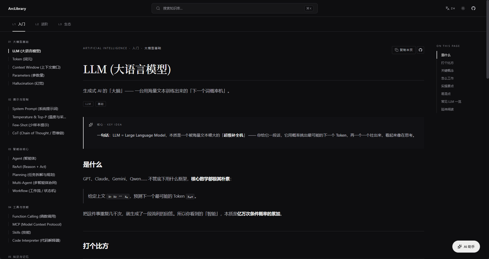

# ArcLibrary

> **可自托管、内置 AI 助手的个人知识库站点。**
> 基于 Next.js + MDX。三层分类：**领域 → 层级 → 知识点**，结构完全由你的 `content/` 目录驱动。

ArcLibrary 是一套"骨架"：克隆下来、把 MDX 丢进 `content/`、部署。
仓库本身对你写什么内容没有任何预设——分类、层级、章节都由数据决定，
所以同一份代码既适合工程笔记，也能用来做课程讲义、研究日志或公开领域指南。

- 📚 **以阅读为先的版式。** 节制的字体排版，1px 细线分割，没有装饰性噪音。
- 🔎 **⌘K 即时搜索** —— Fuse.js + 构建期生成的索引。
- ✨ **AI 助手** —— 读取你写的 MDX，自动跳转并高亮目标段落，无需用户再确认。
- 🧱 **MDX 组件** —— 提示框、键值表、对照、分步流程、Mermaid、KaTeX 开箱即用。
- 🌐 **i18n** 内置（默认中文、可切英文）。
- 📈 **SEO 一等公民** —— 每篇知识点独立 OG / Twitter Card meta、自动 sitemap / robots、动态 OG 头图。

> English → [`README.md`](./README.md)




---

## 快速开始

```bash
git clone https://github.com/<your-org>/ArcLibrary.git
cd ArcLibrary
pnpm install
cp .env.example .env.local        # 可选——填入 OPENAI_API_KEY 等
pnpm dev                          # → http://localhost:3000
```

常用命令：

| 命令               | 说明                                              |
| ------------------ | ------------------------------------------------- |
| `pnpm dev`         | 开发服务器（支持热更新）                           |
| `pnpm build`       | 生产构建（同时重建搜索索引）                       |
| `pnpm start`       | 跑生产构建产物                                     |
| `pnpm lint`        | `eslint .`                                         |
| `pnpm typecheck`   | `tsc --noEmit`                                     |

写作规范、frontmatter 格式与 MDX 组件目录见
**[`AUTHORING_ZH.md`](./AUTHORING_ZH.md)**。
视觉与设计 token 文档见 **[`DESIGN.md`](./DESIGN.md)**（仅英文）。

---

## 目录结构

```text
content/                 # 100% 你的：<领域>/<层级>/<slug>.md(x)
src/
  app/                   # Next.js App Router
    api/chat/route.ts    # AI 接口（限流 + 审计日志）
  components/            # UI 组件
  ai/                    # AI 面板、服务端、工具定义
  lib/                   # 内容加载、限流、审计、站点配置
  i18n/                  # 多语言字典与 Provider
scripts/build-search-index.mjs
public/search-index/zh.json # 按语言分片，构建期生成
public/search-index/en.json # 前端只在用户打开搜索框时按当前语言懒加载
```

路由完全对应文件结构：
`/<领域>/<层级>/<slug>` ↔ `content/<领域>/<层级>/<slug>.md`。

分类由数据驱动：在 `src/lib/config.ts` 编辑 `CATEGORIES` / `LEVELS`，
然后建出对应的 `content/<slug>/<level>/` 目录。侧栏、面包屑、搜索索引、
AI 工具会自动识别。

---

## OG


---

## AI 助手

页面右下角"Ask AI"按钮唤出。助手通过工具调用读取你写的 MDX，并被允许
**自动**跳转、高亮目标段落，无需用户额外确认。

### 配置

```env
# 必填，启用 AI
OPENAI_API_KEY=sk-...

# 可选——默认值如下
OPENAI_BASE_URL=https://api.openai.com/v1
OPENAI_MODEL=gpt-4o-mini

# 限流参数
ARC_AI_RATE_CAPACITY=20
ARC_AI_RATE_WINDOW_MS=60000
ARC_AI_ALLOWED_ORIGINS=https://wiki.example.com
```

支持任何**兼容 OpenAI 协议**的端点：Azure / vLLM / Ollama / DeepSeek / Qwen /
OpenRouter / Together / Groq …。未设置 `OPENAI_API_KEY` 时面板会挂载但
显示"尚未配置"。

### 防滥用与审计

- **同源校验。** 跨站 POST 直接 `403 forbidden`，除非 Origin / Referer
  落在 `ARC_AI_ALLOWED_ORIGINS` 里。
- **基于 IP 的内存令牌桶。** 默认每分钟 20 次，可调。
- **请求体大小限制。** 最多 24 条消息、单条 4 000 字符、整体 16 000 字符。
- **审计日志。** 每次 `/api/chat` 都会在 stdout 写一行结构化 JSON，
  前缀为 `[arc-ai-audit]`，包含调用方 IP、截断后的 User-Agent、host /
  origin、locale、模型、消息条数与字符数、tool call 次数、上游返回的
  **token 用量**与请求耗时。`vercel logs` / `docker logs` /
  `journalctl` 等任意日志通道都能直接采集。**任何 prompt 内容都不会被记录。**

令牌桶在内存里，多区域部署时把 `src/lib/rate-limit.ts` 换成
Redis/Upstash 实现即可，公开 API `consume(key, cost?)` 保持稳定。

---

## 站点统计

可选接入 [Rybbit](https://rybbit.io)。脚本 URL 与 site ID 都从环境变量读：

```env
NEXT_PUBLIC_RYBBIT_SITE_ID=<your-site-id>
NEXT_PUBLIC_RYBBIT_SCRIPT_URL=https://app.rybbit.io/api/script.js  # 可选
```

**Fork 时务必留空**——这样别人复刻部署时不会把流量打到你的统计账号。
只在你自己的"正版"部署的环境变量里配置即可。

---

## 部署

### Vercel

1. Fork / push 到 GitHub。
2. 在 [Vercel](https://vercel.com) 点 "Import Project"。
3. 按 `.env.example` 配置环境变量，别忘了 `NEXT_PUBLIC_SITE_URL`。
4. 部署。`pnpm build` 会自动重建搜索索引。

### Docker

仓库自带多阶段 `Dockerfile` 和 `docker-compose.yml`，可一键部署：

```bash
cp .env.example .env             # 填好变量
docker compose up -d --build     # → http://localhost:3000
```

镜像基于 Next.js 的
[`output: "standalone"`](https://nextjs.org/docs/pages/api-reference/next-config-js/output)
模式，运行层 ~150 MB。生产部署建议放在 Caddy / Nginx / Traefik 后面，由
反向代理处理 TLS 并透传 `X-Forwarded-For`，让限流器拿到真实客户端 IP。

### Node 自托管

```bash
pnpm install
pnpm build
PORT=3000 pnpm start
```

---

## 贡献

1. **写内容** —— `.md` 丢进 `content/<领域>/<层级>/`，
   按 [`AUTHORING_ZH.md`](./AUTHORING_ZH.md) 填好 frontmatter，开 PR。
2. **写代码** —— 先看 [`DESIGN.md`](./DESIGN.md)，保持改动小而集中，
   推送前跑 `pnpm lint && pnpm typecheck`。

---

## 许可证

MIT，详见 [`LICENSE`](./LICENSE)。
