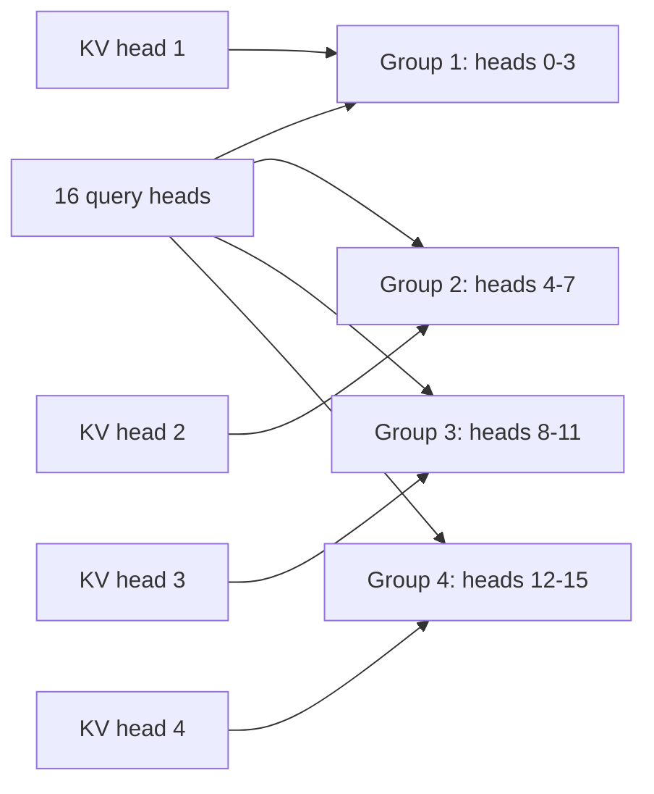

<KeyIdea>
**In one line**: Standard MHA inference saturates **memory bandwidth via the KV cache**. MQA / GQA let multiple query heads share KV; FlashAttention moves the computation into SRAM — the trifecta **speeds up both training and inference several-fold**.
</KeyIdea>

## The MHA bottleneck

For every layer and every token, the entire KV cache must be read from HBM into the SM. **At long contexts**:

- Memory bandwidth ≫ compute → the GPU's compute units sit idle waiting for data;
- KV cache size = `2 * L * H * d * dtype`. Doubling sequence length doubles the cache.

## The three big optimisations

<Terms items={[
  { term: "MQA", en: "Multi-Query Attention", def: "Many Q heads, only 1 set of KV → KV cache shrinks to 1/H. Slight quality drop, big speedup." },
  { term: "GQA", en: "Grouped-Query Attention", def: "Compromise between MHA and MQA: group Q heads, each group shares one KV pair. Mainstream in LLaMA-2/3, Qwen, etc." },
  { term: "FlashAttention", en: "Block-wise IO optimisation", def: "Tile Q/K/V into SRAM and run softmax there, avoiding repeated HBM reads. **Less compute isn't the point; less data movement is.**" },
  { term: "PagedAttention", en: "vLLM's memory manager", def: "Slice the KV cache into uniform pages allocated on demand → batch utilisation maxed out across many requests." },
  { term: "SWA", en: "Sliding Window Attention", def: "Only attend to the last N tokens (Mistral). Combined with RoPE extrapolation." },
  { term: "MLA", en: "Multi-Latent Attention", def: "DeepSeek-V2/V3's low-rank latent approach — compresses KV further." },
]} />

## Analogy

<Analogy>
**MHA** = **every writer has a personal librarian** (K/V pair);  
**MQA** = **the whole town shares one librarian** — fast but coarse;  
**GQA** = **a few writers share one librarian** — quality and speed both win;  
**FlashAttention** = the librarian **brings the books to the desk once and reads everything in place** — no more shelf trips for every lookup.
</Analogy>

## How GQA works

KV-head count = 4 instead of 16 → KV cache 4× smaller.

## Practical notes

- **Check the model card for `num_key_value_heads`.** Less than `num_attention_heads` = GQA. LLaMA-3 8B: 32 vs 8.
- **FlashAttention v2/v3** integrates almost for free — PyTorch 2 SDPA, xformers, TransformerEngine all ship with it.
- **Long context** = SWA + positional-encoding extrapolation (RoPE / NTK-aware / YaRN) + long-context SFT data.
- **Estimate KV-cache footprint**: `bytes ≈ 2 * num_layers * KV_heads * head_dim * seq_len * 2 (bf16)`. 70B at 4K context is usually a few GB.
- **Quantise the KV cache**: int8 / fp8 shrinks it further; **quality loss is mostly at the long-context tail**.
- **Self-hosting fine-tuning**: FlashAttention + LoRA + 8/4-bit quant lets a 24 GB GPU run 7B SFT.

## Easy confusions

<Compare
  leftTitle="Algorithm-layer (MQA/GQA)"
  rightTitle="Implementation-layer (FlashAttention)"
  left={<>
    Different model structure. 
    Requires retraining or fresh init.
  </>}
  right={<>
    Mathematically equivalent to MHA, IO optimised. 
    Drop-in replacement.
  </>}
/>

## Further reading

- [Transformer & Attention](/ai/advanced/transformer)
- [KV Cache](/ai/advanced/kv-cache)
- [vLLM](/ai/ecosystem/vllm)
