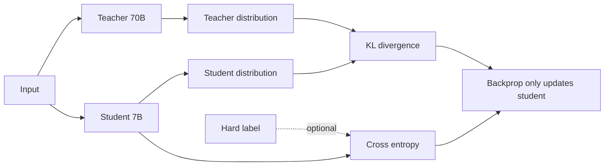

<KeyIdea>
**In one line**: Distillation has a small model (the **student**) imitate a large model (the **teacher**) — not just the hard label but the **full probability distribution**. At the same parameter count, distilled models are far stronger than ones trained from scratch.
</KeyIdea>

## What it is

```
Traditional:  label "cat" → student loss (one right answer)
KD:           teacher output [0.7 cat, 0.2 leopard, 0.05 tiger...] → student imitates the distribution
```

Learning the full distribution = learning **inter-class relationships** (cat and leopard similar > cat and aeroplane) — far more information than a hard label.

## Analogy

<Analogy>
Traditional training = **rote memorisation**: "this question's answer is B".  
Distillation = **the teacher walks through the reasoning**: B is most likely, A is plausible but missing detail, C/D are wrong — the student learns the **reasoning path**.
</Analogy>

## Key concepts

<Terms items={[
  { term: "Teacher / Student", en: "Teacher / Student", def: "Teacher is typically larger / stronger and already trained; student is the one we train." },
  { term: "Soft Targets", en: "Soft targets", def: "Teacher's full softmax probabilities (with temperature). Much more informative than hard labels." },
  { term: "Temperature", en: "Temperature", def: "softmax / T; T>1 smooths the distribution, exposing inter-class differences." },
  { term: "On-policy / Off-policy", en: "Strategy", def: "Score the student on its own outputs (better) vs. on a fixed dataset." },
  { term: "Sequence Distillation", en: "Sequence-level", def: "Match the student's whole-sequence distribution to the teacher's, not token-by-token loss." },
  { term: "Self-distillation", en: "Self-distillation", def: "Teacher = an earlier version of the student; iterative refinement." },
]} />

## Three mainstream approaches

<KV items={[
  { k: "Classic KD (Hinton 2015)", v: "KL(student || teacher) + α·CE(student, label)." },
  { k: "Sequence-level KD", v: "Teacher generates large volumes of data; student does SFT on it. Most common." },
  { k: "On-policy distillation (DistillD)", v: "Student emits tokens, teacher provides feedback. Better quality but expensive." },
]} />

## How it works



Only the student's parameters are updated; the teacher is frozen.

## Practical notes

- **Data beats loss tricks.** 99% of practical distillation = **teacher generates data → student SFT**. "Soft-label KL" matters less than producing 1M high-quality samples.
- **Pick a teacher per domain.** General Q&A: GPT-4 / Claude / DeepSeek-V3; vertical domains: domain-expert models.
- **Distil chains of thought.** Have the teacher emit reasoning traces, student learns the whole CoT. Phi / Orca series follow this approach.
- **Rejection sampling.** Teacher generates many candidates → auto-validate / score → keep only the best to train the student.
- **Student ceiling.** No matter how much you distil, you can't exceed the teacher. **A 1.5B will not "be" 70B**, but it can approach it on specific sub-tasks.
- **License caveat.** Many commercial APIs forbid using their outputs to train your own model. Open-weight models (Qwen / DeepSeek / Llama) are looser but still check the terms.

## Easy confusions

<Compare
  leftTitle="Distillation"
  rightTitle="Quantization"
  left={<>
    **Architecture change (smaller).**<br />
    Requires training.
  </>}
  right={<>
    **Precision change (cheaper).**<br />
    Mostly training-free.
  </>}
/>

## Further reading

- [SFT](/ai/advanced/sft)
- [Quantization](/ai/advanced/quantization)
- [RLHF](/ai/advanced/rlhf)
