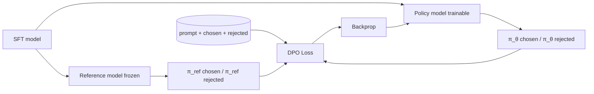

<KeyIdea>
**In one line**: DPO collapses "learn a reward → optimise with PPO" into **one step**, fitting "**chosen is better than rejected**" with a single classification loss. **Simple to implement and stable to train** — the most popular alignment method after RLHF.
</KeyIdea>

## What it is

The dataset looks like:

```json
{
  "prompt": "Explain what the GFW is",
  "chosen": "The GFW is ...(neutral, thorough, objective)",
  "rejected": "The GFW is ...(emotional, biased)"
}
```

DPO directly trains: "make chosen more probable under the model than under the reference, and the further above rejected, the better."

## Analogy

<Analogy>
RLHF = **train a judge → have the contestant compete repeatedly → scored by judge → iterate**: many steps, prone to flying off.  
DPO = **give the contestant paired exemplars** — "which of these two is better" — **skip the judge**, far less hassle.
</Analogy>

## Key concepts

<Terms items={[
  { term: "Reference Model", en: "Reference model", def: "Typically the post-SFT model, frozen. DPO leans the model towards chosen but **not too far from the reference**." },
  { term: "β", en: "KL coefficient", def: "Controls how far we drift from reference. Large β = conservative, small β = aggressive — analogous to RLHF's KL coef." },
  { term: "Pairwise", en: "Pairwise preference", def: "Needs chosen/rejected pairs; **no absolute scores required**." },
  { term: "IPO / KTO / SimPO", en: "DPO variants", def: "Refinements of DPO's loss; KTO doesn't need pairs, just thumbs up/down." },
  { term: "Iterative DPO", en: "Iterative DPO", def: "Last round's model → score → form preference pairs → DPO again. Similar to RLHF but more stable." },
]} />

## How it works



Mathematically equivalent to maximum-likelihood over an implicit reward `r = β log(π/π_ref)`.

## Practical notes

- **Quality > quantity.** 1k high-quality preference pairs beat 10k noisy ones. Use GPT-4 / Claude as judge for automated comparisons.
- **Start from SFT.** DPO on a base model that hasn't been SFT'd performs poorly. SFT first, then DPO.
- **Tune β.** Common range 0.1 ~ 0.5. Train 1 epoch in small steps and watch the reward margin (chosen vs rejected) move.
- **Overfit warning.** Tiny preference set + many epochs → model becomes "spiky" and emits weird answers.
- **Production loop**: SFT → DPO → safety eval → ship / iterate.
- **Small models too.** LoRA + DPO on a 7B with a single 24 GB GPU is feasible; TRL / axolotl ship it out of the box.

## Easy confusions

<Compare
  leftTitle="RLHF (PPO)"
  rightTitle="DPO"
  left={<>
    Reward model + PPO.<br />
    Powerful but unstable to train.
  </>}
  right={<>
    A single classification loss.<br />
    Simple and stable; quality close to PPO.
  </>}
/>

## Further reading

- [RLHF](/ai/advanced/rlhf)
- [SFT](/ai/advanced/sft)
- [Evaluation & Benchmarks](/ai/advanced/evaluation)
