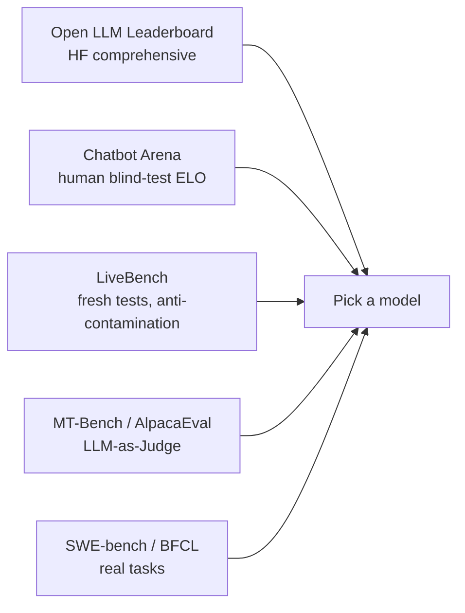

<KeyIdea>
**In one line**: There are three families of LLM evaluation: **automatic benchmarks** (MMLU / GSM8K / HumanEval), **human head-to-head / arenas** (Chatbot Arena), and **LLM-as-Judge** (use a strong model as evaluator). Any one alone is incomplete — **read them in combination**.
</KeyIdea>

## Three families

<KV items={[
  { k: "Static Benchmarks", v: "MMLU, GSM8K, HumanEval, CMMLU, MATH. Objective but easy to cheat / contaminate." },
  { k: "Arena / Human eval", v: "Users blind-test two models → vote. Chatbot Arena ELO is among the most authoritative today." },
  { k: "LLM-as-Judge", v: "GPT-4 / Claude scores answers. MT-Bench, AlpacaEval use this." },
  { k: "Targeted task tests", v: "Tool use (BFCL), long context (LongBench, RULER), multilingual (CMMLU), safety (Anthropic HH), etc." },
]} />

## Analogy

<Analogy>
**Benchmark** = **a college entrance exam**: objective scores, easy to compare; **easy to game**.  
**Arena** = **a debate with audience voting**: close to real use, but **slow and expensive**.  
**LLM-Judge** = **another A-student grading**: fast, **biased** (prefers long / verbose / familiar style).
</Analogy>

## Key concepts

<Terms items={[
  { term: "Pass@k", en: "Pass@k", def: "Probability of at least one pass out of k samples. HumanEval / MBPP standard." },
  { term: "ELO", en: "Chess-style rating", def: "Arena uses it to rank models, updating scores per match." },
  { term: "Judge Bias", en: "Judge bias", def: "GPT-4 prefers longer answers, its own family, and answers placed first. Mitigate with position swap." },
  { term: "Contamination", en: "Contamination", def: "Test items leak into training data → inflated scores. HELM, MMLU have all seen this." },
  { term: "Holistic Eval", en: "Holistic evaluation", def: "HELM, Open LLM Leaderboard combine many dimensions into one score." },
  { term: "End-to-end Task Eval", en: "Real-task eval", def: "SWE-bench (real GitHub issues), AgentBench, etc. — closer to actual utility." },
]} />

## Popular leaderboards

**Reading any single leaderboard is misleading**; cross-checking is reliable.

## Practical notes

- **Model-selection workflow:**
  1. Use Arena ELO + Open LLM Leaderboard to narrow candidates;
  2. Run **your own test set** as a small-traffic A/B;
  3. Have your ops / product folks eyeball — don't trust automatic scores alone.
- **Custom eval set.** Write 50–200 questions matching your domain (including edge cases / adversarial / persona violations). Re-run on every model upgrade.
- **Anti-contamination.** Write your own; add private signatures; rotate periodically.
- **LLM-Judge counters.** Position swap (A first vs B first) + multi-judge voting (GPT-4o + Claude + DeepSeek).
- **Capability ≠ usability.** MMLU 90 doesn't mean it's nice to use. **"Useful" is often RLHF + output style + speed**, not raw knowledge.

## Easy confusions

<Compare
  leftTitle="Automatic benchmarks"
  rightTitle="Human / arena"
  left={<>
    Reproducible, cheap. 
    Easy to game and contaminate.
  </>}
  right={<>
    Closer to real use. 
    Slow, expensive, noisy.
  </>}
/>

## Further reading

- [RLHF](/ai/advanced/rlhf)
- [DPO](/ai/advanced/dpo)
- [Prompt Injection](/ai/advanced/prompt-injection)
