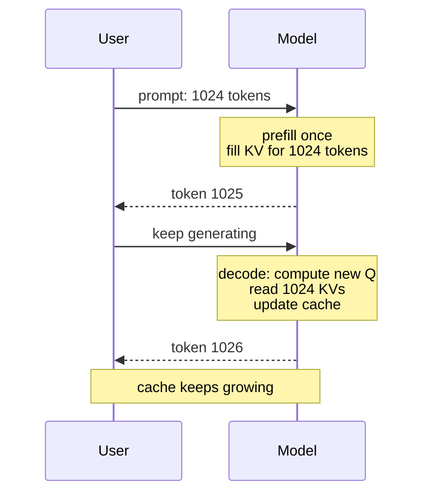

<KeyIdea>
**In one line**: During autoregressive generation, previously-computed K/V matrices are **cached and reused** so we don't recompute the whole prefix for every new token. But the cache **grows linearly with context length** — it's the dominant memory and bandwidth consumer in long-context inference.
</KeyIdea>

## What it is

When generating the N-th token:

- Only compute Q/K/V for **the new token itself**;
- For the previous N-1 tokens, **read K/V from the cache**;
- Run attention with the new Q against all cached K.

Without cache → recompute everything for every token → O(N²) per step → O(N³) total.  
With cache → O(N) per step → O(N²) total.

## Analogy

<Analogy>
The KV cache is the **meeting transcript**: when a new speaker chimes in, only this one statement needs recording; for the rest you **just consult the file** — no need to make everyone **say it all again**.
</Analogy>

## Size estimation

```
KV cache bytes ≈
   2 (K + V)
 × num_layers
 × num_kv_heads        // post-GQA / MQA
 × head_dim
 × seq_len
 × dtype_bytes         // bf16 = 2, fp8 = 1, int4 = 0.5
```

LLaMA-3 70B, 8K context, bf16:

```
2 × 80 × 8 × 128 × 8192 × 2  ≈  2.7 GB
```

At batch 16 → 43 GB — **the KV cache alone needs its own GPU**.

## Key concepts

<Terms items={[
  { term: "Prefill / Decode", en: "Prefill / Decode", def: "Prefill computes all prompt tokens at once (compute-bound). Decode emits one token at a time (bandwidth-bound)." },
  { term: "PagedAttention", en: "Paged cache", def: "vLLM slices the cache into 16-token pages to avoid fragmentation from uneven sequence lengths." },
  { term: "Continuous Batching", en: "Continuous batching", def: "New requests are inserted into the batch immediately, not at batch boundaries — throughput doubles." },
  { term: "Prefix Cache", en: "Prefix reuse", def: "Shared system prompts → reuse KV → save prefill time." },
  { term: "KV Quant", en: "KV quantisation", def: "int8 / int4 KV further shrinks long-context VRAM (mild quality loss)." },
  { term: "Off-load", en: "Offloading", def: "Long-context KV lives in CPU / NVMe, swapped back to GPU on demand (slow, but holds)." },
]} />

## How it works



## Practical notes

- **Throughput and latency are different things.** Slow prefill = long TTFT (time to first token); slow decode = low TPS (tokens per second). Different fixes.
- **vLLM / TensorRT-LLM / SGLang** already implement PagedAttention + continuous batching + prefix cache. **Hand-rolled inference will always lose.**
- **For very long contexts (>32K)** the KV cache dominates: consider KV quantisation / sliding-window attention / RoPE extrapolation + hybrid local-global attention.
- **Long system prompts**: turn on prefix cache so N users share one KV.
- **Batch inference OOMs**: lower `max_seq_len` or `max_num_seqs` instead of unlimited batching.
- **batch=1 doesn't save much KV**: cache size scales with `seq_len`, not batch.

## Easy confusions

<Compare
  leftTitle="Prefill"
  rightTitle="Decode"
  left={<>
    Process the whole prompt at once.<br />
    Compute-bound, can run with large batches.
  </>}
  right={<>
    One token at a time.<br />
    Bandwidth-bound — **most of the optimisation surface lives here**.
  </>}
/>

## Further reading

- [Attention Variants](/ai/advanced/attention-variants)
- [Speculative Decoding](/ai/advanced/speculative-decoding)
- [vLLM](/ai/ecosystem/vllm)
