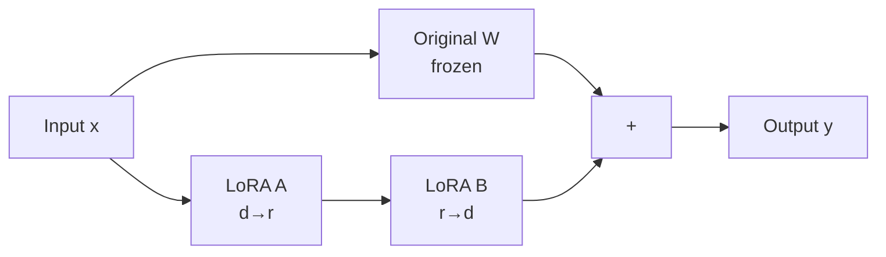

<KeyIdea>
**In one line**: LoRA = **Low-Rank Adaptation**. During fine-tuning, **freeze the original model weights** and only train two **small low-rank matrices** added beside each layer. Result: 100–1000× fewer trainable parameters, dramatically less VRAM, almost no quality drop — making fine-tuning of large models feasible on a single consumer GPU.
</KeyIdea>

## What it is

The original weight matrix W is d×d. LoRA doesn't touch W; it adds a side path `ΔW = B·A`, where A is d×r, B is r×d, and r is typically 4 / 8 / 16, **far smaller than d**.

```
Original: y = W·x
LoRA:     y = W·x + (B·A)·x   ← only A and B are trainable
```

Trainable parameters drop from d² to 2·d·r. **For a 70B model, the trainable footprint goes from hundreds of GB to hundreds of MB.**

## Analogy

<Analogy>
Original model = **a thick, already-printed book**.  
Full fine-tuning = **reprint the entire book** — expensive.  
LoRA = **stick a few sticky notes onto the book** without changing the printed text. Want a new style? Swap the sticky notes — **multiple LoRAs can hot-swap**.
</Analogy>

## Key concepts

<Terms items={[
  { term: "Rank (r)", en: "Rank", def: "The 'narrowness' of LoRA matrices. Common: r=8 / 16. Larger = more expressive but more params." },
  { term: "Alpha (α)", en: "Scaling factor", def: "Controls LoRA output amplification. Often set α=2r." },
  { term: "Target Modules", en: "Target layers", def: "Usually applied to attention q/k/v/o. FFN is also possible but heavier." },
  { term: "Adapter", en: "Adapter", def: "The trained LoRA file — just A and B matrices, very small (MB to hundreds of MB)." },
  { term: "Merge", en: "Merge", def: "At inference time A·B can be folded into W, giving zero extra overhead." },
]} />

## How it works



**Only the blue A and B train; the grey W is frozen.** Multiple LoRAs can be **trained per task/style** and loaded on demand.

## Practical notes

- **Don't crank r too high.** r=8 is typically enough; cap at r=32. **Large r gains diminish quickly while params balloon.**
- **Higher learning rate than full fine-tuning.** Start at 1e-4 ~ 3e-4 (vs SFT's 1e-5).
- **Quant + LoRA = QLoRA.** Quantise base model to 4-bit, train LoRA in fp16. **A single 24 GB card can fine-tune a 70B.**
- **Adapters hot-swap.** One base + N LoRAs = N task-specific models. **Saves storage.**
- **Pick the right target layers.** Default to q/v; **adding to everything ≈ full fine-tuning and defeats the purpose.**

## Easy confusions

<Compare
  leftTitle="LoRA"
  rightTitle="Full Fine-tuning"
  left={<>
    **Hundreds of MB** of params.<br />
    Hours on a single GPU. Cheap and flexible.
  </>}
  right={<>
    **Hundreds of GB** of params.<br />
    Needs a cluster, expensive.
  </>}
/>

<Compare
  leftTitle="LoRA"
  rightTitle="Prompt Tuning / P-Tuning"
  left={<>
    Side path on **weight matrices**.<br />
    Quality close to full fine-tuning.
  </>}
  right={<>
    Trains only an input-side **soft prompt**.<br />
    Lighter, but typically weaker quality.
  </>}
/>

## Further reading

- [SFT](/ai/advanced/sft) — LoRA is an efficient SFT implementation
- [Quantization](/ai/advanced/quantization) — QLoRA combines them
- Paper: "LoRA: Low-Rank Adaptation of Large Language Models" (Hu et al., 2021)
