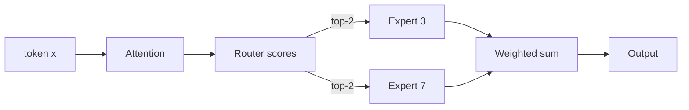

<KeyIdea>
**In one line**: MoE replaces a single FFN with **N parallel expert FFNs**; each token is **routed** to only a few of them (e.g. top-2). **Total params are large** → more knowledge; **active params are small** → cheap inference.
</KeyIdea>

## What it is

A regular Transformer has one big FFN per layer. MoE swaps that for "router + multiple experts":

```
Token → Router → pick top-K experts → those experts compute → weighted sum → output
```

DeepSeek-V3 has 671B total params but activates only ~37B per token — **runs like a 37B model**.

## Analogy

<Analogy>
A dense model = **every question asked of every expert in the room** — expensive, and most experts contribute nothing.  
MoE = **the registrar routes**: math questions to math experts, writing questions to writing experts — **more people total** (broader knowledge), **fewer asked per question** (lower cost).
</Analogy>

## Key concepts

<Terms items={[
  { term: "Expert", en: "Expert", def: "An FFN sub-network. A layer typically has 8 / 64 / 256 experts." },
  { term: "Router / Gate", en: "Router", def: "Small learned network that outputs a score per expert." },
  { term: "Top-K", en: "Top-K", def: "Usually top-2 — only the two highest-scored experts participate." },
  { term: "Load Balance Loss", en: "Load-balance loss", def: "Auxiliary loss preventing all tokens from collapsing to one expert." },
  { term: "Shared Expert", en: "Shared expert", def: "Designs like DeepSeek's: a small fraction of experts is always active to carry general knowledge." },
  { term: "EP / TP", en: "Parallelism", def: "Expert Parallelism puts different experts on different GPUs. Communication cost is MoE training's hardest problem." },
]} />

## How it works



Weights are the router's softmax scores.

## Practical notes

- **Total params ≠ inference cost.** Read model cards for total vs active params. Mixtral 8x7B → 47B total / ~13B active.
- **VRAM still scales with total.** All experts must be in VRAM (**"active" doesn't mean "saves RAM"**). **MoE inference needs lots of memory, not lots of compute.**
- **Router jitter.** Similar contexts may route differently → outputs slightly unstable. Common tricks: higher top-k, temperature annealing.
- **Fine-tuning gotchas.** Naive SFT can break the router. Freeze the router and only train experts, or apply LoRA to experts.
- **Distributed training.** Experts on different GPUs → all-to-all communication dominates; Megatron-LM and DeepSeek's framework include heavy optimisations.

## Easy confusions

<Compare
  leftTitle="Dense Model"
  rightTitle="MoE Model"
  left={<>
    Every token uses all parameters.<br />
    Simple, compute-heavy.
  </>}
  right={<>
    Every token uses a subset.<br />
    Memory-heavy, compute-light.
  </>}
/>

## Further reading

- [Transformer & Attention](/ai/advanced/transformer)
- [Attention Variants (MQA/GQA/Flash)](/ai/advanced/attention-variants)
- [Quantization](/ai/advanced/quantization)
