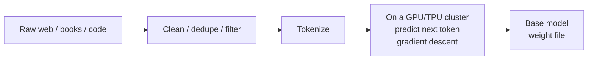

<KeyIdea>
**In one line**: Pre-training = on **trillions of tokens** of text, train the model on one simple task — **predict the next token**. This single step yields grammar, world knowledge, reasoning frameworks, and is the foundation everything else (fine-tuning, alignment) sits on.
</KeyIdea>

## What it is

Data: web pages + books + papers + code + conversations + … (post-cleaning, ~10–15 TB of text).

Task: for any text, **predict the next word**:

```
Input:  "The cat sat on the"
Model predicts: "mat" (highest probability)
Correct: "mat"  ← loss = 0
```

After **trillions of these predictions**, the model has compressed into its weights "**how language works + how the world works**" — that's the post-pre-training "**base model**".

## Analogy

<Analogy>
Pre-training is like **letting a child read the entire library** — nobody quizzes them; **they just keep guessing the next sentence**. After enough books, they pick up grammar, common sense, rhetoric.  
SFT / RLHF afterwards is "**teach them to answer politely**".
</Analogy>

## Key concepts

<Terms items={[
  { term: "Next Token Prediction", en: "Next-token prediction", def: "The only training objective. Simple + massive data = emergent capability." },
  { term: "Tokens Trained", en: "Tokens trained", def: "Llama 3 ≈ 15T, DeepSeek-V3 ≈ 14.8T — order of magnitude directly determines capability ceiling." },
  { term: "Compute", en: "Training compute", def: "Measured in FLOPs. Chinchilla rule: ~20 tokens per parameter for compute-optimal training." },
  { term: "Data Mixture", en: "Data mixture", def: "The ratio of web / code / math / multilingual / long-doc data — every lab's secret sauce." },
  { term: "Base Model", en: "Base model", def: "The 'raw' post-pre-training artifact; it continues text but doesn't 'reply' nicely — needs SFT / RLHF." },
]} />

## How it works



Pre-training is a **one-shot, very expensive offline engineering effort**: tens of thousands of GPU-months, millions to hundreds of millions of dollars per run.

## Practical notes (application view)

- **App engineers don't do pre-training.** 99.9% of practitioners **never need to train from scratch** — open-weights base / chat models + fine-tuning is enough.
- **Understand "data sets the ceiling".** Whether a model knows Rust or can answer medical questions depends on how much of that data was in pre-training. **RAG / SFT can supplement, but cannot create what isn't there.**
- **Base vs Chat.** Open-weights repos usually publish both. Base is for your own SFT; Chat is ready to use. **Mixing them up makes for surprises.**
- **Watch the "T tokens" number.** "**How many trillion tokens**" predicts capability better than "**how many billion parameters**" (Chinchilla / Llama 3 papers).
- **Don't teach grammar in the prompt.** Pre-training has language nailed — prompts should teach **task format**, not language.

## Easy confusions

<Compare
  leftTitle="Pre-training"
  rightTitle="SFT / Fine-tuning"
  left={<>
    Massive **unlabeled** data.<br />
    Learns language + world knowledge.
  </>}
  right={<>
    Small amount of **labeled** data.<br />
    Teaches task format / style.
  </>}
/>

<Compare
  leftTitle="Continued Pre-training"
  rightTitle="Pre-training"
  left={<>
    **Continue pre-training** on top of an existing base.<br />
    Add specialised language / domain data.
  </>}
  right={<>
    **Start from random weights.**<br />
    Most expensive, rarest.
  </>}
/>

## Further reading

- [LLM](/ai/beginner/llm) — the deliverable of pre-training
- [SFT](/ai/advanced/sft) — the fine-tuning stage that follows
- [RLHF](/ai/advanced/rlhf) — turn the model into "something that talks"
- [Emergent Abilities](/ai/advanced/emergent-abilities) — a side-effect of scale at pre-training
