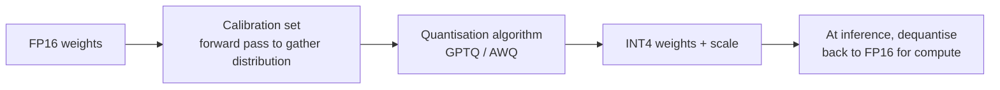

<KeyIdea>
**In one line**: Quantisation = drop weight / activation precision from **fp16 / fp32 down to int8 / int4 or lower**. A 70B model takes 140 GB at fp16 but only ~35 GB at int4 — **VRAM down 75%, inference 2–4× faster, quality nearly intact**. The key technique to **fit big models onto local / edge devices**.
</KeyIdea>

## What it is

Weights are originally floating-point:

```
fp16: 0.123456    (2 bytes)
int8: 16          (1 byte,  ÷2)
int4: 2           (0.5 byte, ÷4)
```

Each weight uses fewer bits, **coarser precision but smaller footprint**. At inference we reconstruct an approximate value — **with the right error budget the model's output drops only marginally**.

## Analogy

<Analogy>
Full precision = **ingredients measured to 7 decimal places** — the chef can distinguish 0.1234 g from 0.1235 g.  
Quantisation = **switch to grams as the smallest unit** — most dishes taste the same.  
**A well-quantised meal is indistinguishable in a blind test.**
</Analogy>

## Key concepts

<Terms items={[
  { term: "FP32 / FP16 / BF16", en: "Floating point", def: "BF16 / FP16 are mainstream for training. FP32 is mostly only used for calibration." },
  { term: "INT8 / INT4 / 2bit", en: "Integer precision", def: "Common for inference. INT4 is the 'capacity vs quality' sweet spot." },
  { term: "PTQ", en: "Post-Training Quantization", def: "Quantise after training is done. The most common path." },
  { term: "QAT", en: "Quantisation-aware training", def: "Simulate quant error during training. Better quality but requires retraining." },
  { term: "GGUF / AWQ / GPTQ", en: "Quant formats", def: "GGUF is the llama.cpp default; AWQ / GPTQ are PTQ algorithms + formats." },
]} />

## VRAM comparison

| Model | FP16 | INT8 | INT4 |
|---|---|---|---|
| 7B  | 14 GB | 7 GB | **3.5 GB** |
| 13B | 26 GB | 13 GB | **6.5 GB** |
| 70B | 140 GB | 70 GB | **35 GB** |
| 175B | 350 GB | 175 GB | **88 GB** |

INT4 is typically the boundary for consumer hardware — **a 24 GB 4090 can squeeze in a 70B at INT4**.

## How it works



Smart algorithms (AWQ / GPTQ) **keep the most important weights at high precision** and drop the rest to INT4, **minimising quality loss**.

## Practical notes

- **Default to GGUF + Q4_K_M.** Largest llama.cpp ecosystem, good quality, runs on CPU/GPU. **The default for most local deployments.**
- **Be careful for sensitive tasks.** Programming, math, long-chain reasoning are quantisation-sensitive. **Start with INT8, then drop to INT4 only if it holds up.**
- **Run benchmarks, not the headline number.** "1% quality loss" is an average; **your task may drop 5%**. Test on your own data.
- **Quant + LoRA = QLoRA.** Model in INT4, LoRA adapters in FP16. **Fine-tune 70B on a single GPU.**
- **Production via vLLM + AWQ / GPTQ.** Throughput and VRAM utilisation beat GGUF — **the high-traffic default**.

## Easy confusions

<Compare
  leftTitle="Quantization"
  rightTitle="Distillation"
  left={<>
    Same model, **lower precision**.<br />
    Structure preserved.
  </>}
  right={<>
    Train a **smaller model**.<br />
    Structure changes; behaviour learned from teacher.
  </>}
/>

<Compare
  leftTitle="PTQ"
  rightTitle="QAT"
  left={<>
    **Quantise after training.**<br />
    Simple, fast, mainstream.
  </>}
  right={<>
    **Simulate quant during training.**<br />
    Slightly better quality, requires retraining; rarely used.
  </>}
/>

## Further reading

- [Local Inference](/ai/advanced/local-inference) — quantisation's ultimate destination
- [LoRA](/ai/advanced/lora) — QLoRA combines the two
- Tools: llama.cpp / Ollama / LM Studio / vLLM
