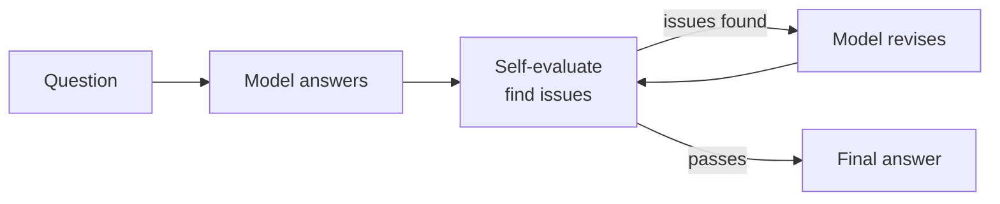

<KeyIdea>
**In one line**: Reflection = **make the model audit its own answer**: "**Is this right? Where might it be wrong?**" If not, rewrite. The cheapest way to turn "one-shot inference" into a "**write → critique → rewrite**" iterative loop.
</KeyIdea>

## What it is

```
Round 1:
  Question: write SQL for top-5 cities by Q3 sales
  Answer: SELECT city, SUM(amount)... ORDER BY amount LIMIT 5

Round 2 (Reflection):
  Critique: this SQL is missing GROUP BY — it will error.
  
Round 3:
  Revise: SELECT city, SUM(amount) ... GROUP BY city ORDER BY ...
```

**The same model is its own marker.** One extra call typically halves the error rate.

## Analogy

<Analogy>
When humans write, we **read it back once**: first pass on instinct, second pass to find issues, third pass to fix.  
Reflection = bake this into the prompt — have the model **code-review its own output**.
</Analogy>

## Key concepts

<Terms items={[
  { term: "Self-Critique", en: "Self-critique", def: "Prompt the model to find flaws in its own output: 'where might this be wrong?'" },
  { term: "Verifier", en: "Verifier", def: "Same model, a stronger model, or an external tool (compiler / tests)." },
  { term: "Iteration", en: "Iteration", def: "'Write → critique → revise' can loop N rounds — usually 1–3 is enough." },
  { term: "Reflexion", en: "Reflexion algorithm", def: "Write past failure causes into 'memory' for future decisions. Reflection-on-steroids." },
]} />

## How it works



Each arrow is one LLM call — **overhead is bounded**.

## Practical notes

- **Make the self-eval prompt specific.** "**List the 3 most likely errors, then decide whether to revise**" beats "check this."
- **Prefer objective verifiers.** Anything that can run tests / a compiler / a calculator should — model self-eval has a "self-flattery" bias.
- **Cap iterations.** 1–3 rounds usually plateau; more rounds risks **making it worse**.
- **Reflection often beats sampling-N-and-vote** at the same token budget.
- **Always-on for high-stakes work.** Writing code, math, SQL, long-doc summaries — **errors are costly, the extra round pays for itself**.

## Easy confusions

<Compare
  leftTitle="Reflection"
  rightTitle="Self-Consistency"
  left={<>
    **Critique + rewrite.**<br />
    Sequential rounds, each builds on the last.
  </>}
  right={<>
    **Independent samples + vote.**<br />
    Parallel, never interact.
  </>}
/>

<Compare
  leftTitle="Reflection"
  rightTitle="Tool-based verify"
  left={<>
    Model **judges itself**.<br />
    Cheap but may miss issues.
  </>}
  right={<>
    Use a **compiler / test / calculator**.<br />
    Objective and reliable — use it whenever possible.
  </>}
/>

## Further reading

- [ReAct](/ai/beginner/react) — Reflection is commonly embedded inside the ReAct loop
- [CoT](/ai/beginner/cot) — Reflection = CoT-answer + CoT-critique
- [ToT](/ai/advanced/tot) — the evaluation step resembles ToT's pruning
