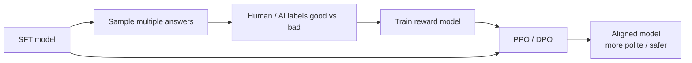

<KeyIdea>
**In one line**: RLHF = **Reinforcement Learning from Human Feedback**. Have humans compare two answers, **train a "preference scorer" (Reward Model)**, then use RL to push the LLM towards the **human-preferred direction**. This was the key step that made ChatGPT **"suddenly usable"**.
</KeyIdea>

## What it is

Three stages:

1. **SFT** — Start with human demonstration data, train a base model that "answers properly."
2. **Train a Reward Model (RM)** — Sample multiple answers per question, **have humans rank them**, then train a small model that can score any answer.
3. **PPO / DPO fine-tuning** — Use RL to make the model maximise the reward, **while not drifting too far from the SFT model** (KL constraint).

After all this the model is "**polite, on-topic, knows its limits**" — the industry approach to "alignment".

## Analogy

<Analogy>
SFT = teach a child **how to answer**.  
RLHF = the teacher **scores two essays**: "this one is better than that one" — the child gradually learns **the teacher's grading standards**, rather than memorising answers.
</Analogy>

## Key concepts

<Terms items={[
  { term: "Reward Model (RM)", en: "Reward model", def: "A classifier / regressor: input (question, answer), output a score." },
  { term: "Preference Data", en: "Preference data", def: "Paired samples (chosen, rejected) — tens of thousands, human-labelled or LLM-judged." },
  { term: "PPO", en: "Proximal Policy Optimization", def: "Classic RLHF algorithm. Complex, expensive, runs four models simultaneously." },
  { term: "DPO", en: "Direct Preference Optimization", def: "Proposed in 2023 — train the LLM directly on preference data; no separate RM or PPO needed." },
  { term: "RLAIF", en: "RL from AI feedback", def: "Use a strong model as judge instead of humans — major cost savings." },
]} />

## How it works

In production today **DPO** has become the de-facto standard — engineering complexity is an order of magnitude lower than PPO.

## Practical notes

- **App engineers rarely do RLHF**, unless you're building a base model or working on safety alignment. **Most use cases are fine with open-source aligned models (Llama-Instruct / Qwen-Chat).**
- **If you must, pick DPO.** 5–20k preference samples, single-GPU hours. Simpler than PPO.
- **Preference data can be "semi-AI".** Have GPT-4 judge 9k samples, then human-review 1k — **best quality/cost trade-off**.
- **Beware "over-alignment".** The model **refuses everything**. In your preference data, **include "reasonable refusal vs. over-refusal" pairs**.
- **Why ChatGPT beats base.** A base model is a "text monster" that just continues text; **RLHF turns it into a usable product**.

## Easy confusions

<Compare
  leftTitle="RLHF"
  rightTitle="SFT"
  left={<>
    **Compare good vs. bad** — learn scoring standards. 
    Suppresses "meh" answers.
  </>}
  right={<>
    **Imitate demonstrations** — learn specific answers. 
    Can't express "A is better than B".
  </>}
/>

<Compare
  leftTitle="DPO"
  rightTitle="PPO"
  left={<>
    **Train directly on preference data.** 
    Simple, stable, cheap. Current default.
  </>}
  right={<>
    **Train RM + online sampling + RL.** 
    Complex, expensive, fragile.
  </>}
/>

## Further reading

- [Pre-training](/ai/advanced/pre-training) → [SFT](/ai/advanced/sft) → RLHF — the modern three-stage LLM training
- [Hallucination](/ai/beginner/hallucination) — RLHF reduces hallucination as a side effect
- Paper: "Training language models to follow instructions with human feedback" (InstructGPT, 2022)
