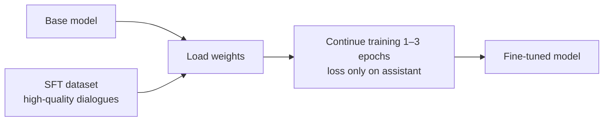

<KeyIdea>
**In one line**: SFT = **Supervised Fine-Tuning**: prepare a small set of `{user input, expected answer}` pairs and **use the same "next-token prediction" objective to teach the model to answer in your format**. It's the most direct way to make a base model **"speak the way you want."**
</KeyIdea>

## What it is

The data looks like:

```jsonl
{"messages":[{"role":"user","content":"What is an LLM?"},
             {"role":"assistant","content":"An LLM is a large language model..."}]}
{"messages":[{"role":"user","content":"Help me request a refund"},
             {"role":"assistant","content":"Sure — please share your order number..."}]}
```

The model is **trained for a few more epochs** on these dialogues; loss is computed only on the assistant's reply. **A few thousand high-quality conversations** are enough to turn a base model into "customer-support voice", "medical voice", "brand persona", etc.

## Analogy

<Analogy>
Pre-training = **read the whole library**; learns language.  
SFT = **show it a stack of "exemplary essays" to imitate** — it learns the pattern "**this kind of question gets this kind of answer**".  
You're not making it know more — you're making it **answer in your style**.
</Analogy>

## Key concepts

<Terms items={[
  { term: "Instruction Tuning", en: "Instruction tuning", def: "SFT's earlier name — instruction/answer pairs that make the model 'listen.'" },
  { term: "Quality > Quantity", en: "Quality > quantity", def: "1k handpicked ≫ 100k filler. Demonstrated by the LIMA paper." },
  { term: "Loss Mask", en: "Loss mask", def: "Compute loss only on assistant tokens; ignore user input." },
  { term: "Catastrophic Forgetting", en: "Catastrophic forgetting", def: "Over-fine-tuning loses general ability. Mix data or limit epochs." },
]} />

## How it works



Technically **identical to pre-training** (next-token prediction); only the **data scale + loss mask** differ.

## Practical notes

- **Data quality is 90% of the work.** A week polishing 1,000 examples **beats a month assembling 100k noisy ones.**
- **Default to LoRA.** Unless you have a big GPU cluster, full-parameter SFT is too expensive. **LoRA fine-tunes in hours on a single GPU.**
- **Lower learning rate than pre-training.** Start 1e-5 ~ 5e-5. **Crank it up and you'll lobotomise the base model.**
- **Mix in general data to prevent forgetting.** Add 1:1 generic dialogue **or the model will only answer your task and break everything else**.
- **Try prompt + few-shot first.** If a prompt fixes it, don't SFT. **SFT toolchains are complex; prompts iterate by editing one line.**

## Easy confusions

<Compare
  leftTitle="SFT"
  rightTitle="RLHF"
  left={<>
    **Imitate good answers**: teach the model "answer this way."
  </>}
  right={<>
    **Compare good vs. bad**: use preference data to **avoid bad answers**.
  </>}
/>

<Compare
  leftTitle="SFT"
  rightTitle="RAG"
  left={<>
    Bake knowledge / style **into the weights**.<br />
    Updating means retraining.
  </>}
  right={<>
    Stuff knowledge **into the prompt at runtime**.<br />
    Updating means editing the corpus.
  </>}
/>

## Further reading

- [Pre-training](/ai/advanced/pre-training) — the step before SFT
- [LoRA](/ai/advanced/lora) — SFT's low-cost implementation
- [RLHF](/ai/advanced/rlhf) — SFT's next step: alignment
