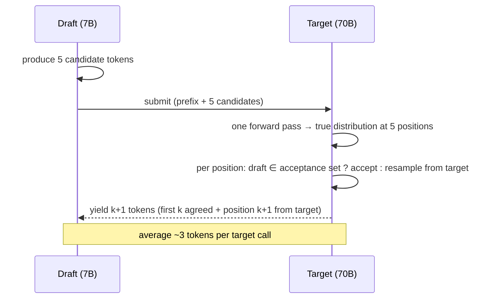

<KeyIdea>
**In one line**: A **lightweight draft model** guesses K tokens at once; the **target model verifies all K in parallel**. Accept the agreed prefix in one go; on disagreement, fall back to the target's choice. **Mathematically equivalent output distribution**, 2–3× faster.
</KeyIdea>

## What it is

```
Traditional decode: 1 big-model call per token

Spec decode:
  Draft model proposes 5 tokens at once
  Target model: one forward pass (incremental KV) → real distributions at all 5 positions
  Accept each position if draft ⊆ acceptance set; otherwise replace with target's sample
  Average: 2-4 tokens per big-model call
```

## Analogy

<Analogy>
The draft model is the **intern who writes the first draft of the minutes**; the big model is the **manager who reviews 5 paragraphs at once** — most pass through; only the rejected ones get rewritten. **Bulk review** beats sentence-by-sentence dictation.
</Analogy>

## Key concepts

<Terms items={[
  { term: "Draft Model", en: "Draft model", def: "A small fast model (often a smaller member of the same family, e.g. Llama-3 8B drafting for 70B)." },
  { term: "Verification Step", en: "Verification", def: "Forward the K candidate tokens through the target once, **get true distribution at all K positions**." },
  { term: "Acceptance Rate", en: "Acceptance rate", def: "Fraction where draft matches target. 50–80% common." },
  { term: "Lossless", en: "Lossless", def: "Sampling distribution strictly equivalent — guaranteed by rejection sampling math." },
  { term: "Medusa / Eagle / Lookahead", en: "Draft-less variants", def: "Use the model's own auxiliary heads to predict future tokens; no separate draft model." },
  { term: "Self-speculative", en: "Self-speculative", def: "Use early layers of the same model as the draft; full model as verifier." },
]} />

## How it works



## Practical notes

- **High acceptance hinges on similarity.** Draft and target should share family / RLHF lineage.
- **Right-size the draft.** Too large → it isn't faster. Typically **1/10 ~ 1/30** of the target.
- **High temperature / divergent sampling** → acceptance drops, speedup shrinks. Greedy / low-temperature gets the best speedup.
- **vLLM / TGI / TensorRT-LLM** all ship spec-decode (auto-pick Medusa / draft model).
- **In serving**: multiple requests can share a draft, saving more compute.
- **Don't expect quality gains.** Spec decode is **mathematically identical** to the target's normal decode.

## Easy confusions

<Compare
  leftTitle="Speculative Decoding"
  rightTitle="Quantization / Distillation"
  left={<>
    **Doesn't touch weights**; pure inference speedup.<br />
    Mathematically equivalent — **same output**.
  </>}
  right={<>
    **Modifies weights** (precision / size).<br />
    Output differs slightly.
  </>}
/>

## Further reading

- [KV Cache](/ai/advanced/kv-cache)
- [Quantization](/ai/advanced/quantization)
- [vLLM](/ai/ecosystem/vllm)
