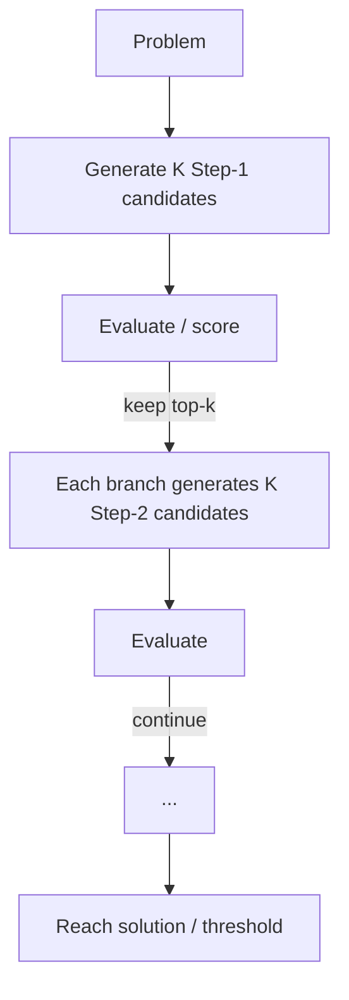

<KeyIdea>
**In one line**: ToT = **Tree of Thoughts**, treat reasoning as a tree. At every step **generate several candidate thoughts**, score them, and **only expand the most promising branches** — replacing CoT's single intuitive chain with **search + evaluation**.
</KeyIdea>

## What it is

CoT is linear:

```
Step1 → Step2 → Step3 → Answer
```

ToT is a branching tree:

```
Step1 ┬─ A1 (score 0.7) ─┬─ A1a (0.9) ✓
      ├─ A2 (score 0.4)  └─ A1b (0.3) ✗
      └─ A3 (score 0.6)
```

Each level generates N candidates → model (or external judge) scores → expand top-k → continue → walk to leaves, pick best path.

## Analogy

<Analogy>
- CoT = **walk a maze head down** — if you go wrong, you hit a dead end.  
- ToT = **at each junction, mentally walk a few steps down each branch and judge which is most promising**, then commit.  
**Tree search** has been standard in chess and Go forever — ToT plugs it into LLM reasoning.
</Analogy>

## Key concepts

<Terms items={[
  { term: "Thought", en: "Thought node", def: "An intermediate reasoning state in the tree — a chunk of natural language." },
  { term: "Generator", en: "Generator", def: "A prompt that produces K diverse candidate thoughts in one go." },
  { term: "Evaluator", en: "Evaluator", def: "Another prompt (often the same model) that scores or votes." },
  { term: "Search Strategy", en: "Search strategy", def: "BFS / DFS / Beam Search — how to traverse the tree." },
]} />

## How it works



Essentially **tree search where the LLM is both node-generator and self-evaluator (heuristic)**.

## Practical notes

- **Pick the right task.** Sudoku, 24-game, planning, long proofs — problems with **a verifiable answer or evaluator**. Open-ended writing doesn't need ToT.
- **Token cost explodes.** N layers × K candidates is exponential. In practice use 2–3 layers, 3–5 candidates per layer.
- **Design the evaluator carefully.** A three-way vote ("confident / not confident / sure") is more stable than direct scalar scoring.
- **Try simpler first.** **CoT + Self-Consistency** (sample 5–10 CoTs and vote) is often good enough — **an order of magnitude simpler than ToT**.
- **Rarely deploy raw ToT in production.** Usually replaced by ReAct + partial backtrack / reflection — more controllable.

## Easy confusions

<Compare
  leftTitle="ToT"
  rightTitle="CoT"
  left={<>
    **Multi-path + search.**<br />
    For solvable hard problems; expensive.
  </>}
  right={<>
    **Single-path intuition.**<br />
    Cheap, covers most cases.
  </>}
/>

<Compare
  leftTitle="ToT"
  rightTitle="Self-Consistency"
  left={<>
    Builds an **explicit tree**, scores and prunes per layer.
  </>}
  right={<>
    Sample **N independent full CoTs** and vote.<br />
    Simpler to implement, often near-equivalent in quality.
  </>}
/>

## Further reading

- [CoT](/ai/beginner/cot) — the simpler ancestor
- [Reflection](/ai/advanced/reflection) — adding "self-critique" inside ReAct can approximate ToT gains
- Paper: "Tree of Thoughts" (Yao et al., 2023)
