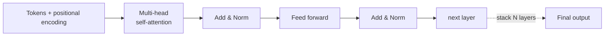

<KeyIdea>
**In one line**: Transformer is the 2017 neural-network architecture that uses **Self-Attention** to let every token in a sequence "**glance at every other token**" and compute their importance to itself. GPT / Claude / Gemini / DeepSeek today are all variants of it.
</KeyIdea>

## What it is

Before Transformer there was RNN/LSTM — sentences had to be **fed one token at a time**, and long-range dependencies degraded. Transformer feeds the **whole sequence at once**, and each token uses Attention to figure out "**which other tokens matter to me**":

```
"The cat sat on the mat because it was tired"

When computing 'it':
  - the:  0.02
  - cat:  0.83  ← high
  - sat:  0.05
  - mat:  0.04
  - tired: 0.06
```

The model directly sees that `it` refers to `cat` — **long-range dependencies no longer decay**.

## Analogy

<Analogy>
RNN = **relay race** — information passes baton-by-baton; the further it travels the more is lost.  
Transformer = **round-table meeting** — all words sit at the table at once; each word looks around and **decides whose voice to listen to**.
</Analogy>

## Key concepts

<Terms items={[
  { term: "Self-Attention", en: "Self-attention", def: "Each token computes the similarity of its query with every token's key, then weighted-aggregates the values. Core formula: softmax(QK/√d)V." },
  { term: "Multi-Head", en: "Multi-head", def: "N attention heads run in parallel; each head learns a different relation (syntax / semantics / coreference)." },
  { term: "Positional Encoding", en: "Positional encoding", def: "Attention itself is order-blind; positional info has to be injected (absolute / relative / RoPE)." },
  { term: "FFN", en: "Feed-forward layer", def: "An MLP after attention — most of the model's capacity lives here; MoE replaces it." },
  { term: "Decoder-Only", en: "Decoder-only", def: "The simplified GPT variant: autoregressive generation only, no encoder." },
]} />

## How it works



Each Transformer block = `Attention → FFN`, **stacked N times**. GPT-4-class models have 100+ layers.

## Practical notes (application-engineer view)

- **You don't need to re-implement it, but understand the bottleneck.** Doubling context window roughly **squares attention's compute and memory** — which is why long contexts are expensive.
- **Most optimisations target Attention.** FlashAttention (IO-optimised), KV Cache (reuse during inference), GQA / MQA (multiple queries share KV) — virtually all inference speedups come from here.
- **Positional encoding controls extrapolation.** Relative variants like RoPE / ALiBi let models "**train at 4K, run at 128K**".
- **Decoder-only is dominant.** BERT-style encoder-only is used for retrieval / classification; 99% of generative applications are decoder-only.
- **VRAM math**: params × bytes_per_param + KV Cache (≈ batch × seq × layers × heads × head_dim × 2). **For long contexts, KV cache often eats more VRAM than the params**.

## Easy confusions

<Compare
  leftTitle="Encoder-Only"
  rightTitle="Decoder-Only"
  left={<>
    BERT — bidirectional view of context.<br />
    Strong on understanding / classification / retrieval.
  </>}
  right={<>
    GPT — left-to-right generation only.<br />
    Strong on open-ended generation and chat.
  </>}
/>

## Further reading

- [LLM](/ai/beginner/llm) — the "black box" view from the app side
- [Context Window](/ai/beginner/context-window) — Attention's physical cap
- [Quantization](/ai/advanced/quantization) — how to actually run a Transformer
- Must-read paper: "Attention Is All You Need" (2017)
