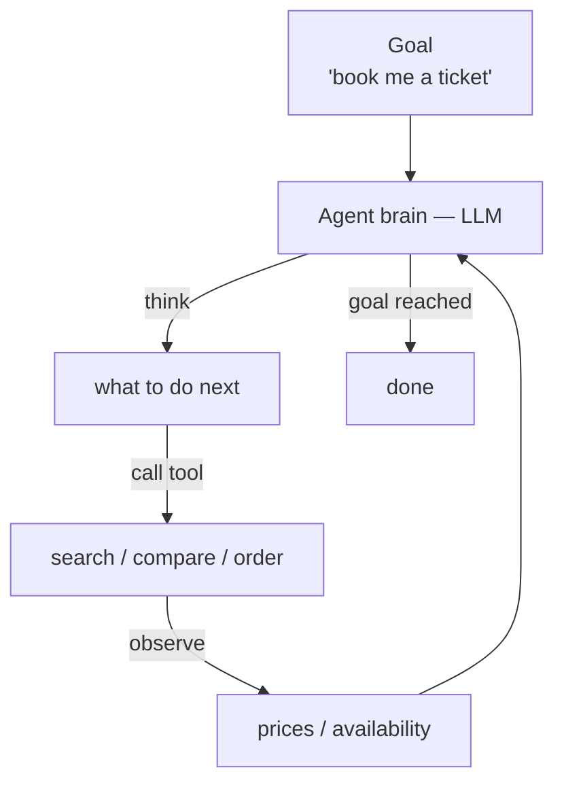

<KeyIdea>
**In one line**: An Agent is an AI system that **perceives an environment, makes its own decisions, calls tools, and iterates until a goal is met** — not just a "ask one, answer one" chatbot.
</KeyIdea>

## What it is

A chatbot answers a single turn. An Agent takes **a goal**, decomposes it into tasks, watches the results, and **picks the next step on its own**. At minimum it has four pieces:

1. **Brain** (LLM) — makes decisions
2. **Tools** — fetch external data, perform actions
3. **Memory** — keeps context and history
4. **Loop** — think → act → observe → think again, until done

## Analogy

<Analogy>
A chatbot is the **restaurant host** — answers what you ask, nothing more.  
An Agent is the **intern** — say "book me a high-speed train to Shanghai tomorrow" and it checks schedules, compares prices, clicks "book", fills in your details, pays, and emails you the PDF — all without you micromanaging each step.
</Analogy>

## Key concepts

<Terms items={[
  { term: "LLM Core", en: "Brain", def: "Every decision is generated by an LLM — it is the Agent's CPU." },
  { term: "Tools", en: "Tools", def: "Search, browser, code interpreter, API calls — the Agent's 'hands' into the outside world." },
  { term: "Planning", en: "Planning", def: "Breaking a big goal into small steps. The line between Agent and chatbot." },
  { term: "Memory", en: "Memory", def: "Short-term (context window) + long-term (vector DB / database) so the Agent can work across sessions." },
  { term: "Loop", en: "Loop", def: "Patterns like ReAct let the model iterate — without a loop you only have a one-shot assistant." },
]} />

## How it works

In essence: Agent = **LLM + Tools + Loop**. Everything else is a refinement on top of those three.

## Practical notes

- **Decide the loop's exit condition first.** Does the model declare "done"? Or do you cap the step count? Without this an Agent will **burn money forever**.
- **The tool description matters more than the tool itself.** Whether the model picks the right tool is 95% a function of how well its `description` and parameter schema are written.
- **A hard-coded shortcut beats full autonomy.** Anything you can pin in the prompt (e.g. "first search, then analyse, then summarise") shouldn't be left to the model — it's both more stable and cheaper.
- **Observability is non-negotiable.** Every think / act / observe step must be traced. Without traces the Agent is a black box you cannot debug.

## Easy confusions

<Compare
  leftTitle="Chatbot"
  rightTitle="Agent"
  left={<>
    Single-turn, stateless. 
    Doesn't call tools, can't actually do things.
  </>}
  right={<>
    Multi-step loop, has memory. 
    Calls tools, changes the world, delivers a result.
  </>}
/>

<Compare
  leftTitle="Agent"
  rightTitle="Workflow"
  left={<>
    **The model decides** what to do next. 
    Flexible but unpredictable.
  </>}
  right={<>
    **A human pre-defines** the nodes and transitions. 
    Stable but never improvises.
  </>}
/>

## Further reading

- [ReAct](/ai/beginner/react) — the canonical "think-act-observe" pattern
- [Planning](/ai/beginner/planning) — decomposing large goals
- [Multi-Agent](/ai/beginner/multi-agent) — collaborating agents
- [Workflow](/ai/beginner/workflow) — the deterministic counterpart to Agents
