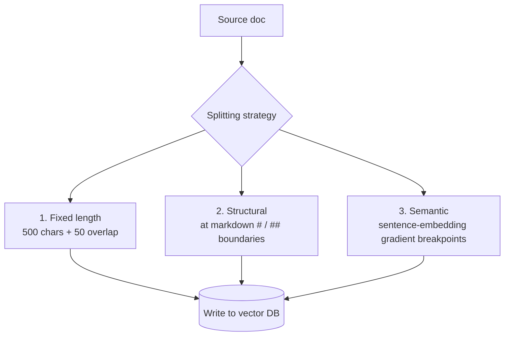

<KeyIdea>
**In one line**: Chunking = **slicing a long document into hundred-to-thousand-character pieces**. RAG retrieves and feeds the model in chunks — so **how you split, how big, with what overlap** essentially caps RAG quality.
</KeyIdea>

## What it is

A 50-page PDF can't be tossed into a vector store wholesale (the embedding becomes unfocused, and you can't fit it back into the context). Common practice:

```
Source: 50-page PDF (50,000 chars)
   ↓ Chunking
chunk_001: piece 1, 500 chars
chunk_002: piece 2, 500 chars (overlaps chunk_001 by 50 chars)
...
chunk_120: piece 120, 500 chars
```

Each chunk is embedded, retrieved, and fed to the model on its own.

## Analogy

<Analogy>
Nobody **memorises an encyclopedia cover-to-cover** to look something up.  
You **flip to "the most relevant pages"** — chunking pre-cuts the book into "pages", **each with one semantic fingerprint**, and you find pages by fingerprint.
</Analogy>

## Key concepts

<Terms items={[
  { term: "Chunk Size", en: "Chunk size", def: "Typically 200–800 chars. Too small loses context; too large dilutes the topic." },
  { term: "Overlap", en: "Overlap", def: "Adjacent chunks share some characters (10–20%) to avoid cutting topics in half." },
  { term: "Splitter", en: "Splitting strategy", def: "By chars / tokens / sentences / paragraphs / markdown headings…" },
  { term: "Metadata", en: "Metadata", def: "Attach doc_id / section title / page number to each chunk so you can trace provenance." },
]} />

## Three mainstream strategies



- **Fixed length**: simplest — flashcards, forum Q&A.
- **Structural**: documents with clear heading hierarchy (books, API docs) — preferred — **respects natural semantic boundaries**.
- **Semantic** chunking: cut where adjacent sentence embeddings show a sudden distance jump — best quality, also most expensive.

## Practical notes

- **Cut by structure first, then by length.** H1/H2/H3, lists, tables are natural boundaries — **don't break them**.
- **Tune chunk size with the embedding model.** Most embedding models top out around 512 tokens; longer gets truncated.
- **Prefix ancestor headings to each chunk.** `# Chapter 3 - ## Refund Policy - chunk text`. **Helps retrieval and generation alike.**
- **Don't chunk small docs.** &lt;2000 chars: keep the whole doc as a single chunk. **Less cutting, less noise.**
- **Two-granularity indexing.** Index at sentence-level chunks for recall, **expand to surrounding paragraph / section** before feeding the model.

## Easy confusions

<Compare
  leftTitle="Chunking"
  rightTitle="Tokenizing"
  left={<>
    **App-layer**: split long text into "passages" (hundreds of chars).
  </>}
  right={<>
    **Model-layer**: split characters into "tokens" (sub-words).<br />
    Different abstraction layer entirely.
  </>}
/>

## Further reading

- [RAG](/ai/beginner/rag) — what chunking ultimately serves
- [Embeddings](/ai/beginner/embeddings) — each chunk gets embedded
- [Vector Database](/ai/beginner/vector-db) — where the chunks live
