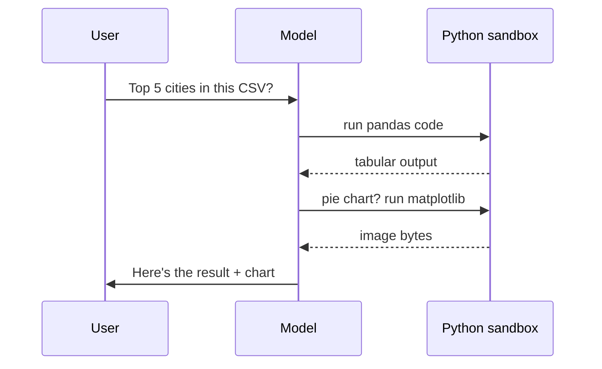

<KeyIdea>
**In one line**: A Code Interpreter is a sandboxed environment (Python by default) that lets the model **write, execute, and inspect code**. When math, files, charts, or data are involved, **the model emits code, runs it, sees the output, then keeps reasoning** — handing the unreliable "mental arithmetic" off to a reliable computer.
</KeyIdea>

## What it is

The flow:

```
User: Which 5 cities have the highest sales in this CSV?

Model: [generates Python]
import pandas as pd
df = pd.read_csv("/mnt/data/sales.csv")
print(df.groupby("city")["amount"].sum().nlargest(5))

Execute: [runs in sandbox]
city
Beijing     1234567
Shanghai     987654
...

Model: Top 5 cities by sales are … (grounded in real output)
```

The model **decides whether and what to write**, the sandbox executes safely, and results feed back to the model.

## Analogy

<Analogy>
An LLM doing mental math = a **gifted bullshitter** running your accounts.  
With Code Interpreter, you hand them **a calculator and scratch paper** — they **actually compute** when numbers show up, and the answer becomes reliable.
</Analogy>

## Key concepts

<Terms items={[
  { term: "Sandbox", en: "Sandbox", def: "Isolated container / VM / WebAssembly. Model code runs there and cannot touch the host." },
  { term: "Stateful Kernel", en: "Persistent kernel", def: "Jupyter-style — variables persist across turns; no need to re-read files each time." },
  { term: "File I/O", en: "File mount", def: "User uploads are mounted into the sandbox (`/mnt/data/`); the model can read and write." },
  { term: "Output", en: "Output capture", def: "stdout / exceptions / charts are all captured and fed back to the model." },
]} />

## How it works



The model treats execution output as an observation and continues reasoning — **the same loop as ReAct**.

## Practical notes

- **Hand off math / data / files first.** Accounting, statistics, format conversion, plotting, regressions — all should go through Code Interpreter, **ten times more precise than chat-style guessing**.
- **Sandbox security.** **Always disallow** network, SSH, sensitive directories. **Minimum permissions** — data analysis only is enough.
- **Kernel reuse vs fresh.** Long sessions reuse the kernel for speed, **but watch for variable pollution**. Multi-tenant products usually issue per-user kernels.
- **Timeouts + resource caps.** CPU / memory / wall time / output size all need limits — **the model can generate infinite loops that pin the host**.
- **Pipe errors back faithfully.** When an exception occurs, send the full traceback back to the model — it will **fix the code and retry**. This is where Code Interpreter really shines.

## Easy confusions

<Compare
  leftTitle="Code Interpreter"
  rightTitle="Plain Function Calling"
  left={<>
    The model **improvises code** to solve the problem.<br />
    Infinitely flexible, also risky — needs a sandbox.
  </>}
  right={<>
    A **fixed set of tools** the model can pick from.<br />
    Predictable, but every new capability needs a new tool to be coded first.
  </>}
/>

<Compare
  leftTitle="Code Interpreter"
  rightTitle="Code Generation"
  left={<>
    **Write + execute**: model runs code in the sandbox and reads the result.
  </>}
  right={<>
    **Write only**: hands the code to the user; doesn't run it.<br />
    Cursor / Copilot default mode.
  </>}
/>

## Further reading

- [Function Calling](/ai/beginner/function-calling) — Code Interpreter is a specialised "tool"
- [Hallucination](/ai/beginner/hallucination) — calling Code Interpreter live to suppress fabrication
- [ReAct](/ai/beginner/react) — "think + run code + observe" is a ReAct loop
