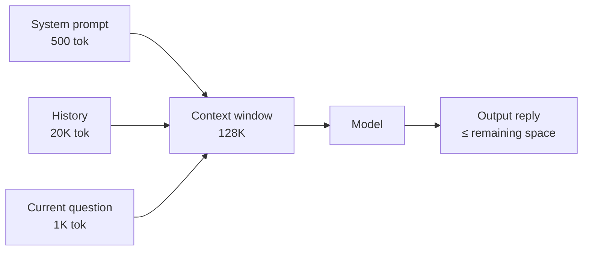

<KeyIdea>
**In one line**: The context window is the total number of Tokens the model can "**see**" in a single inference — system prompt + chat history + current question + model reply, **all added together must not exceed this cap**. Anything over the cap is truncated.
</KeyIdea>

## What it is

Every model has a fixed context-window size. Common numbers:

| Model | Context window |
|---|---|
| GPT-3.5 | 16K |
| GPT-4o | 128K |
| Claude 3.7 / Sonnet 4.5 | 200K |
| Gemini 2.5 Pro | 1M – 2M |
| Qwen3-Long | 1M |

**It is input + output**, not input only.

## Analogy

<Analogy>
The context window is the **sticky note** in front of the model — it can only read what fits on that sticky note. What fits, the model "remembers"; what doesn't fit is **as if it never existed**.
</Analogy>

## Key concepts

<Terms items={[
  { term: "Input Tokens", en: "Prompt", def: "System + history + user question + tool results." },
  { term: "Output Tokens", en: "Completion", def: "What the model generates this turn — answer + tool-call JSON." },
  { term: "Hard Limit", en: "Hard limit", def: "Input + output ≤ context window. Going over throws an error or truncates." },
  { term: "Effective Recall", en: "Effective recall", def: "The cap is not 'all usable' — middle sections of a long context tend to be ignored. Known as 'Lost in the Middle'." },
]} />

## How it works

If system + history already consume 120K, the model can generate at most **8K Tokens** more.

## Practical notes

- **Track the full bill.** For long conversations, count system + history + current + expected output. **Any single overflow fails the call.**
- **Compress history.** Summarise older messages instead of hard-deleting them.
- **Put important content at the ends.** Attention is strongest in the first and last few hundred Tokens. The middle tends to "go missing".
- **Longer is not always better.** Bigger contexts mean **slower, more expensive, and lower effective recall**. If RAG can solve it, don't brute-force the context.

## Easy confusions

<Compare
  leftTitle="Context Window (short term)"
  rightTitle="Long-term Memory"
  left={<>
    The Token cap for this single inference. 
    Disappears entirely when the session ends.
  </>}
  right={<>
    Persists across sessions (vector DB / database). 
    Pulled into context **on demand** via mechanisms like RAG.
  </>}
/>

<Compare
  leftTitle="Context Window"
  rightTitle="Parameters"
  left={<>
    How many Tokens it sees at once — **runtime** capacity.
  </>}
  right={<>
    The number of model weights — **structural** capacity. 
    **Independent** of context size.
  </>}
/>

## Further reading

- [Token](/ai/beginner/token) — the unit of measurement
- [Short-term Memory](/ai/beginner/short-term-memory) — managing context across turns
- [RAG](/ai/beginner/rag) — the standard way to break the context limit
