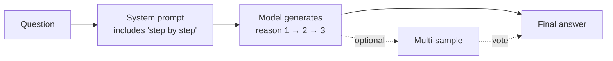

<KeyIdea>
**In one line**: CoT just means **forcing the model to write out the reasoning before stating the conclusion**. Adding "let's think step by step" often **doubles** accuracy on math, logic, and multi-step tasks — the highest-ROI move in all of prompt engineering.
</KeyIdea>

## What it is

**Without CoT** (jumps to an answer):

> Q: Mike has 12 apples, gives 1/3 to Sue, then buys 5 more. How many now?  
> A: **17**  ❌ (wrong)

**With CoT** (writes it out):

> Q: Mike has 12 apples, gives 1/3 to Sue, then buys 5 more. How many now? Think step by step.  
> A: 12 × 1/3 = 4 given away, leaves 12 − 4 = 8, plus 5 = **13** ✅

**The crucial difference**: by spelling out each calculation, every step samples from a smaller, more certain probability distribution — errors no longer compound silently.

## Analogy

<Analogy>
Asking the model to answer directly = asking a **just-woke-up person to do mental math**.  
Adding CoT = handing them **scratch paper**. Same person, same problem — the only thing different is that piece of paper.
</Analogy>

## Key concepts

<Terms items={[
  { term: "Zero-Shot CoT", en: "Zero-shot CoT", def: "Adding 'let's think step by step' alone is enough to trigger reasoning." },
  { term: "Few-Shot CoT", en: "Few-shot CoT", def: "Show the reasoning in the few-shot examples; the model imitates by also writing out reasoning." },
  { term: "Self-Consistency", en: "Self-consistency", def: "Sample CoT multiple times and majority-vote — huge gains where determinism matters." },
  { term: "Hidden CoT", en: "Built-in reasoning", def: "GPT-5 / o1 / DeepSeek R1 bake the chain of thought in — no magic phrase needed." },
]} />

## How it works

**Core assumption**: complex problems decompose into smaller sub-problems whose individual accuracy is far higher than a one-shot answer.

## Practical notes

- **The universal incantation**: "let's think step by step" — works on GPT-4 / Claude / Chinese frontier models alike.
- **Force "reason then conclude"**: in the prompt, ask for **"reasoning first, then a final line `Answer:`"** so a program can extract the answer cleanly.
- **Smaller models benefit most.** The weaker the model, the bigger the CoT lift. GPT-5 / Claude Sonnet 4 class models already do this internally — **explicitly adding it again can just slow things down**.
- **Self-consistency is gold.** When precision matters, set temperature to 0.7, run 5 CoT samples, majority vote — especially effective for OCR extraction and code generation.
- **Don't CoT trivial tasks.** "Is this sentence positive or negative?" needs no reasoning; zero-shot is cheaper and faster.

## Easy confusions

<Compare
  leftTitle="CoT"
  rightTitle="ToT"
  left={<>
    A **single** chain of thought, end to end. 
    One mistake derails the rest.
  </>}
  right={<>
    A **tree** of thoughts — branches at every step, then prune. 
    More robust, also slower.
  </>}
/>

<Compare
  leftTitle="CoT (explicit)"
  rightTitle="Reasoning model (built-in)"
  left={<>
    You add reasoning instructions in the prompt. 
    The model emits the reasoning in its output.
  </>}
  right={<>
    o1 / GPT-5 / DeepSeek R1 think **implicitly** internally. 
    You only see the final answer; reasoning tokens are spent under the hood.
  </>}
/>

## Further reading

- [Few-Shot](/ai/beginner/few-shot) — CoT + Few-Shot combo
- [ToT (Tree of Thoughts)](/ai/advanced/tot) — multi-path upgrade of CoT
- [Reflection](/ai/advanced/reflection) — let the model self-check after reasoning
