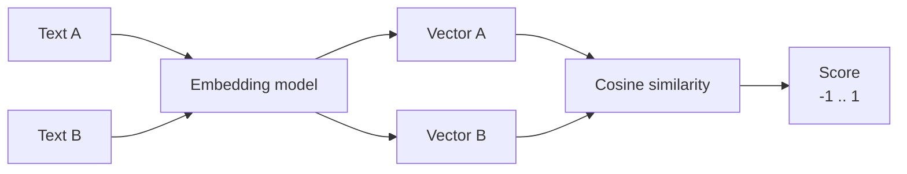

<KeyIdea>
**In one line**: An embedding turns a piece of text into a string of numbers (a high-dimensional vector). **Texts with similar meaning have similar vectors.** This is the first time a computer can compare *meaning* — and it is the foundation of RAG, recommendation, clustering, and deduplication.
</KeyIdea>

## What it is

```
"a puppy runs on the grass"     → [0.12, -0.83, 0.41, ..., 0.07]   (1536-dim)
"a young dog sprints on a lawn" → [0.13, -0.81, 0.40, ..., 0.08]   ← almost identical
"the stock market crashed today"→ [-0.55, 0.22, -0.71, ..., 0.39] ← totally different
```

"**Almost identical**" shows up as a **short distance** in vector space (cosine similarity close to 1). Computing cosine similarity between two sentences **tells you whether they are talking about the same thing**.

## Analogy

<Analogy>
- Keyword search = **literal match** — "dog" and "canine" are different words.  
- Embedding search = **meaning match** — every passage is translated into "**a coordinate of meaning**", then we measure who is closest.
</Analogy>

## Key concepts

<Terms items={[
  { term: "Vector", en: "Vector", def: "A list of floats. Common sizes: 384 / 768 / 1536 / 3072. Higher dimensions are more expressive and more expensive." },
  { term: "Cosine Similarity", en: "Cosine similarity", def: "Compares the direction of two vectors. Range −1..1, 1 means identical." },
  { term: "Embedding Model", en: "Embedding model", def: "A model dedicated to turning text into vectors. OpenAI text-embedding-3, BGE, E5, Cohere, etc." },
  { term: "Dimensionality", en: "Dimensionality", def: "Vector length. Matryoshka embeddings can be truncated and still work." },
]} />

## How it works



The model **projects** text into a thousand-dimensional semantic space. **Position encodes meaning.**

## Practical notes

- **Pick the right model > tune knobs.** For Chinese, BGE / M3E / OpenAI 3-small are all solid — **benchmark on your own corpus first**.
- **One model per project.** Indexing with model A and querying with model B → **completely broken**. Changing models means rebuilding the index.
- **Token budget.** Embeddings are billed per token; a million tokens / tens of thousands of docs costs cents to a couple of dollars — **two orders of magnitude cheaper than LLM calls**.
- **Batch calls.** Most APIs accept 100+ texts per request — **dozens of times faster** than calling one at a time.
- **Truncate aggressively.** A 3072-d vector trimmed to 512-d (Matryoshka-trained models) costs 6× less storage with **negligible recall loss**.

## Easy confusions

<Compare
  leftTitle="Embedding"
  rightTitle="LLM output"
  left={<>
    **Numeric vectors** — for computers to compare similarity.
  </>}
  right={<>
    **Natural-language text** — for humans to read.<br />
    Two completely different output types.
  </>}
/>

<Compare
  leftTitle="Embedding search"
  rightTitle="BM25 keyword search"
  left={<>
    Understands meaning, works across languages.<br />
    Recalls "different wording, same meaning".
  </>}
  right={<>
    Strong on exact strings / named entities.<br />
    Recalls "same name, same form".
  </>}
/>

The best practice is to combine both: **hybrid retrieval**.

## Further reading

- [RAG](/ai/beginner/rag) — embeddings' biggest application
- [Vector Database](/ai/beginner/vector-db) — infrastructure for storing many embeddings
- [Chunking](/ai/beginner/chunking) — the splitting strategy that runs before embedding
