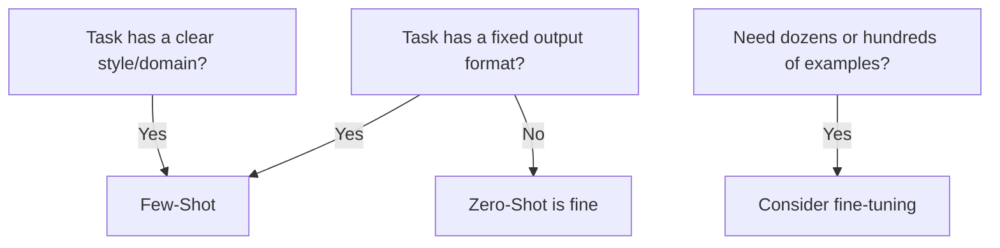

<KeyIdea>
**In one line**: Few-shot means **stuffing a handful of "input → output" examples in the prompt** so the model pattern-matches and follows. No training, no fine-tuning — **a zero-cost way to lock output format and style**.
</KeyIdea>

## What it is

By number of examples:

- **Zero-Shot** — no examples, just ask.
- **One-Shot** — one example.
- **Few-Shot** — 2–5 (returns diminish past that).

```text
Classify the following email as [spam / personal / work]:

Email: "Congrats! Click to claim..."
Label: spam

Email: "Project meeting moved to 3pm tomorrow"
Label: work

Email: "Want to go hiking this weekend?"
Label: personal

Email: "iPhone flash sale, 3 hours left!"
Label:
```

The model will continue with `spam`.

## Analogy

<Analogy>
Few-shot is handing a new hire **three templates**: "all future contracts follow this format." They just swap fields and submit — **no retraining required**.
</Analogy>

## Key concepts

<Terms items={[
  { term: "In-Context Learning", en: "In-context learning", def: "The model does not update weights — it infers the task purely from the examples in the prompt. One of LLMs' strongest capabilities." },
  { term: "Schema Inference", en: "Format inference", def: "Show a few JSON examples, and the output naturally arrives in that JSON shape." },
  { term: "Order Bias", en: "Order bias", def: "Example order subtly tilts the output. The last example has the strongest pull." },
  { term: "Shot count cap", en: "Diminishing returns", def: "3–5 examples are usually enough; more burns context for little gain." },
]} />

## When to use it



## Practical notes

- **Diversify examples.** Three "spam" examples in a row will tilt the model — **show each class at least once**.
- **Right placement.** Put structural constraints in the system message; concrete examples feel more natural in the first user message.
- **Combine with CoT.** Include the reasoning in your examples (Few-Shot + CoT) — the model will imitate the reasoning too, beating either technique alone.
- **Format is a contract.** Use `{"label": "spam"}` in examples and the model will almost always return that exact structure.
- **Mind the Token cost.** Examples **consume context every request**. For high-volume calls, consider fine-tuning so the pattern is baked into weights.

## Easy confusions

<Compare
  leftTitle="Few-Shot (runtime)"
  rightTitle="Fine-tuning (train time)"
  left={<>
    Examples are pasted in **every request**.<br />
    Zero setup cost, but burns context.
  </>}
  right={<>
    **Train once**; examples are baked into weights.<br />
    Has training cost, but long-term saves Tokens.
  </>}
/>

<Compare
  leftTitle="Zero-Shot"
  rightTitle="Few-Shot"
  left={<>
    Relies on prompt description + the model's world knowledge.<br />
    Drifts on complex formats.
  </>}
  right={<>
    Examples act as a **strong format constraint**.<br />
    Output stability shoots up.
  </>}
/>

## Further reading

- [CoT](/ai/beginner/cot) — Few-Shot + CoT is the "most powerful combo"
- [System Prompt](/ai/beginner/system-prompt) — examples in system or user message?
- [Fine-tuning / SFT](/ai/advanced/sft) — when examples accumulate enough, just train
