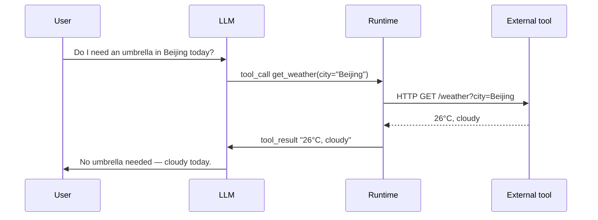

<KeyIdea>
**In one line**: Function Calling lets an LLM **emit something other than prose** — it can output a **structured JSON tool call**, your program actually executes it (weather, API, DB query), and the result feeds back to the model.
</KeyIdea>

## What it is

You declare the available tools up front:

```json
{
  "name": "get_weather",
  "description": "Look up current weather for a given city",
  "parameters": {
    "type": "object",
    "properties": {
      "city": { "type": "string", "description": "City name in Latin or local script" }
    },
    "required": ["city"]
  }
}
```

When the model decides to call one, **instead of speaking** it emits:

```json
{
  "tool_calls": [
    { "name": "get_weather", "arguments": { "city": "Beijing" } }
  ]
}
```

Your program sees that JSON, **actually calls** `get_weather("Beijing")`, sends `"26°C, cloudy"` back to the model, and the model phrases the answer for the user.

## Analogy

<Analogy>
Without Function Calling the model is a **customer who can only talk**: "could you check the weather for me?"  
With Function Calling it becomes a **customer who can place orders**: "**execute `get_weather(city="Beijing")`**" — your program fulfils the order.
</Analogy>

## Key concepts

<Terms items={[
  { term: "Tool Definition", en: "Tool definition", def: "name + description + JSON-schema parameters — the 'manual' you hand to the model." },
  { term: "Tool Call", en: "Tool call", def: "Structured JSON the model emits saying which tool to invoke with what args." },
  { term: "Tool Result", en: "Tool result", def: "What your program returns; fed back as the next message to the model." },
  { term: "Parallel Tool Calls", en: "Parallel calls", def: "Modern models can emit multiple independent calls at once; the runtime runs them concurrently and feeds all results back." },
]} />

## How it works



**The model makes decisions, the runtime executes** — this is the foundation of agents.

## Practical notes

- **Describe the tool's *purpose*.** "Get weather" is much weaker than "**Look up today's weather by city to answer 'should I go out?' style questions**" — model tool-selection accuracy hinges almost entirely on this.
- **Lock down the parameter schema.** Use `enum` for choices, `required` for mandatory fields, `pattern` for formats — the model almost never fills nonsense.
- **Return structured errors.** Don't throw — return `{ "error": "city not found" }` so the model can adjust args and retry.
- **Run in parallel.** Modern SDKs support N concurrent tool calls per turn — **multiple times faster** than serial.
- **Don't expose too many tools.** Above ~20 tools the model's pick rate falls off a cliff. **Classify intent first, then route to a sub-toolkit.**

## Easy confusions

<Compare
  leftTitle="Function Calling"
  rightTitle="MCP"
  left={<>
    Each product **defines its own tool schema**.<br />
    Model ↔ tools are 1:1 bound.
  </>}
  right={<>
    A **standardised protocol across products**.<br />
    Any MCP server is plug-and-play.
  </>}
/>

<Compare
  leftTitle="Function Calling"
  rightTitle="Plugin / Action"
  left={<>
    **Low-level protocol** — JSON at the model layer.
  </>}
  right={<>
    **Application-layer wrapper** — ChatGPT Plugin / Action = Function Calling + a marketplace.
  </>}
/>

## Further reading

- [MCP](/ai/beginner/mcp) — the "USB-C" of Function Calling
- [Skills](/ai/beginner/skills) — bundle tools into "capabilities"
- [Code Interpreter](/ai/beginner/code-interpreter) — the special "tool" of "run arbitrary code"
- [ReAct](/ai/beginner/react) — the loop that repeatedly invokes tools
