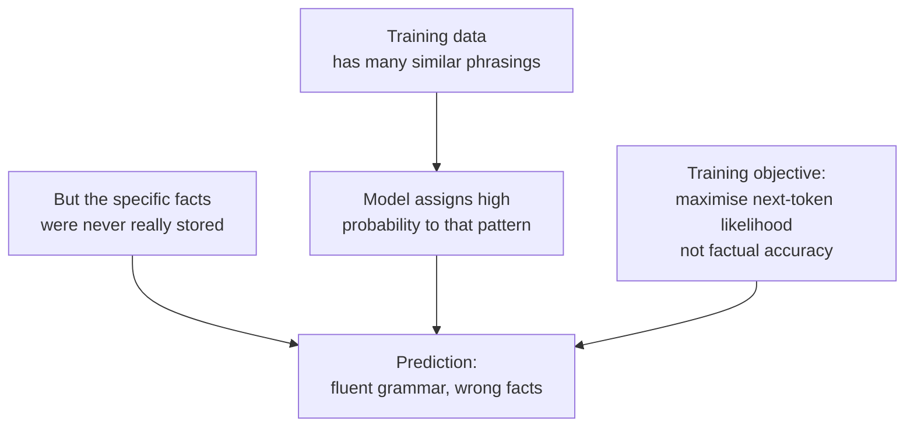

<KeyIdea>
**In one line**: Hallucination is when an LLM **invents content that sounds plausible but is factually wrong**. It is not a bug — it's the natural side-effect of "maximise the next-token probability." The model **does not know what it does not know**.
</KeyIdea>

## What it is

An LLM has no "fact database." It just predicts **what the next word most likely looks like**, given training data. So you get:

- **Fabricated citations**: "Smith 2021 proved that..." — the paper doesn't exist.
- **Fabricated APIs**: "`requests.fetch(url)`" — that method doesn't exist in the `requests` library.
- **Garbled details**: people, years, and numbers get mixed up while the grammar stays flawless.

## Analogy

<Analogy>
The LLM is a **gifted improv actor**: ask it to play "encyclopedia professor" and it will not say "I don't know" — it will **assemble a plausible-sounding answer from feel** — convincing on the surface, but **part fact, part fiction**.
</Analogy>

## Key concepts

<Terms items={[
  { term: "Factual", en: "Factual hallucination", def: "Objective information is wrong: people, dates, citations, statistics." },
  { term: "Context Drift", en: "Context drift", def: "Disagreement with material you provided — 'the doc doesn't say that, the model filled it in.'" },
  { term: "Schema Drift", en: "Schema drift", def: "You asked for JSON, it gave you extra or missing fields." },
  { term: "Tool Drift", en: "Tool drift", def: "Function-calling invents tools or parameters that don't exist." },
]} />

## Why hallucination happens

**The core tension**: the loss function rewards "looks like training data," **not** "is factually correct."

## Practical notes (how to suppress it)

- **Plug in RAG.** Let the model answer from real documents — [RAG](/ai/beginner/rag) is the industry-standard answer.
- **Hard prompt constraints.** "**Use only material I provide; if it isn't there, say 'I don't know'**" alone slashes hallucinations.
- **Demand provenance.** Make the model cite a snippet ID or page after every claim, and **refuse to answer without a citation**.
- **Lower temperature.** For factual tasks, set [Temperature](/ai/beginner/temperature) to 0–0.3 to reduce improvisation.
- **Verify with tools.** For numbers, dates, SQL results, etc., let [Code Interpreter](/ai/beginner/code-interpreter) do the math live.
- **Two-stage self-check.** Generate the answer, then have the model "check the previous reply for unsupported claims" — see [Reflection](/ai/advanced/reflection).

## Easy confusions

<Compare
  leftTitle="Hallucination"
  rightTitle="Stale / unknown"
  left={<>
    The model **fabricates** non-existent facts. 
    Usually highly "confident" — no uncertainty signal.
  </>}
  right={<>
    The model genuinely **doesn't know** post-cutoff information. 
    Can be patched with RAG / web search.
  </>}
/>

<Callout type="warn" title="Legal / medical / financial use cases">
**Never trust LLM output blindly** for high-stakes decisions. Either human-review or RAG + strict citations + refuse-to-answer.
</Callout>

## Further reading

- [RAG](/ai/beginner/rag) — the standard answer to crushing hallucinations
- [Temperature & Top-P](/ai/beginner/temperature) — sampling-side fixes for "making things up"
- [Reflection](/ai/advanced/reflection) — let the model self-check
