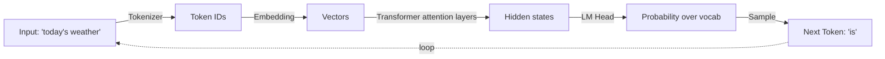

<KeyIdea>
**In one line**: LLM = Large Language Model. At heart it is a "**super autocomplete**" fed by an enormous text corpus — you give it a passage, it picks the most likely next Token by probability, and emits them one at a time. Looks like thinking; isn't.
</KeyIdea>

## What it is

GPT, Claude, Gemini, Qwen… whatever framework sits underneath, **the core math is almost embarrassingly simple**:

> Given context `x₁ x₂ … xₙ`, predict the most likely next Token `xₙ₊₁`.

Repeat that a few thousand times and a fluent paragraph drops out. The "intelligence" you see is **billions of conditional-probability draws stacked end to end**.

## Analogy

<Analogy>
An LLM is that one friend who **always finishes your sentence** — say half a line, they snap right onto the back half. The only twist: their reading list is the entire internet plus tens of millions of books, code repos, and papers.
</Analogy>

## Key concepts

<Terms items={[
  { term: "Tokenizer", en: "Tokenizer", def: "The doorway that slices human text into a stream of integer IDs." },
  { term: "Embedding", en: "Embedding", def: "Turns every Token ID into a vector so the model can do math on it." },
  { term: "Transformer Blocks", en: "Transformer Blocks", def: "The bulk of the model — attention + feed-forward layers stacked tens to hundreds deep." },
  { term: "LM Head", en: "LM Head", def: "Computes a probability distribution over the vocabulary and picks the next Token." },
]} />

## How it works

**Loop this process** until the model emits an end-of-text Token, and the whole reply is done.

## Practical notes

- **It is a probability machine.** "Understanding, reasoning, creativity" all sit on top of "the probability of the next Token" — which is why it **makes things up** (see [Hallucination](/ai/beginner/hallucination)).
- **It has no real-time world.** Models have a "knowledge cutoff". For fresh facts, plug in [RAG](/ai/beginner/rag) or tool calls.
- **It does not actually learn from chat.** Talk to it ten thousand times and not a single weight changes. To make it "remember" you either fine-tune, or attach [long-term memory](/ai/beginner/long-term-memory).

## Easy confusions

<Compare
  leftTitle="LLM"
  rightTitle="Search engine"
  left={<>
    **Generative**: writes the answer on the fly from probabilities. 
    Answers **may be wrong** — fabricated text can still sound plausible.
  </>}
  right={<>
    **Retrieval**: picks from existing pages. 
    Answers are text that **really exists** somewhere in the source.
  </>}
/>

## Common LLMs at a glance

| Model | Vendor | Notes |
|---|---|---|
| GPT-5 / GPT-4o | OpenAI | General-purpose, reasoning, tool use |
| Claude Sonnet 4.5 | Anthropic | Long context, writing, code |
| Gemini 2.5 | Google | Multimodal, video understanding |
| Qwen3 / DeepSeek V3 | Alibaba / DeepSeek | Chinese, cost-effective, self-hostable |
| Llama 4 | Meta | Open-weights baseline for self-hosting |

## Further reading

- [Token](/ai/beginner/token) — the smallest unit the LLM handles
- [Context Window](/ai/beginner/context-window) — how much it can see at once
- [Parameters](/ai/beginner/parameters) — what 7B / 72B really means
- [Hallucination](/ai/beginner/hallucination) — why it confidently makes things up
