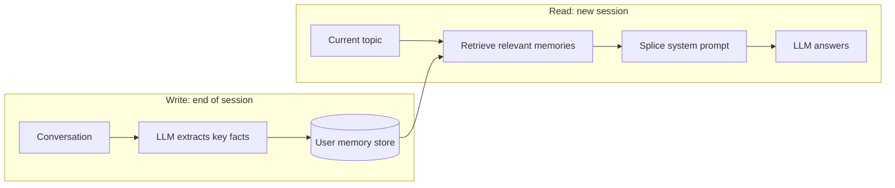

<KeyIdea>
**In one line**: Long-term memory persists key user information **across sessions** (preferences, relationships, past decisions), and at the start of each new session **retrieves the relevant entries** into the prompt. So the AI no longer "meets you for the first time" every chat.
</KeyIdea>

## What it is

Short-term memory only handles the current session. Long-term memory handles:

```
2024-09-01: User mentioned "I'm allergic to peanuts"
2024-09-15: User prefers concise answers; dislikes bullet lists
2024-11-02: User is building a side-project SaaS in Next.js

→ written to user memory store

At the start of the next session:
  retrieve memories relevant to today's topic, splice top-3 into system prompt
```

The AI **flips through its notes first**, **then speaks** — like an old friend.

## Analogy

<Analogy>
Short-term memory = **today's chat notes** — gone after the meeting.  
Long-term memory = **the Notion page about this person** — reviewed before each next meeting. **That's the difference between "know you" and "introduce ourselves again."**
</Analogy>

## Key concepts

<Terms items={[
  { term: "Extraction", en: "Fact extraction", def: "Run an LLM at session end / key checkpoints to mine 'worth remembering' facts." },
  { term: "Memory Store", en: "Memory store", def: "Usually a vector DB + metadata. Each entry = a fact + embedding + timestamp." },
  { term: "Retrieval", en: "Memory retrieval", def: "At session start, retrieve top-K memories matching the current topic into the system prompt." },
  { term: "Update / Decay", en: "Update & decay", def: "New facts override old; long-unused memories get demoted or deleted." },
]} />

## How it works



Write once (async, cheap), read every session.

## Practical notes

- **Don't memorise everything.** Skip chitchat and one-off questions. **Only store facts with cross-session value** — preferences, key relationships, long-term goals.
- **Give the extraction prompt a schema.** Have the model emit JSON `{type, content, expires_at}` rather than free text. **Avoids noise explosion.**
- **Resolve conflicts.** When the user says "**I'm using Vue now**," update or expire the old "Next.js" memory — **don't blindly append.**
- **Give the user a "view / delete memories" UI.** Compliance + trust. ChatGPT's Memory page is a good model.
- **Small projects can start with SQLite + an LLM-extraction script.** No need to immediately reach for Mem0 / Letta / LangMem.

## Easy confusions

<Compare
  leftTitle="Long-term memory"
  rightTitle="RAG knowledge base"
  left={<>
    Stores **per-user personal** facts.<br />
    Written / updated dynamically across sessions.
  </>}
  right={<>
    Stores **content shared by all users**.<br />
    Indexed in batch on the backend.
  </>}
/>

<Compare
  leftTitle="Long-term memory"
  rightTitle="Fine-tuning (SFT)"
  left={<>
    **Retrieved at runtime**; per-user isolated.<br />
    Cheap, can be written to immediately.
  </>}
  right={<>
    Bakes memory into weights.<br />
    Not per-user, expensive, inflexible.
  </>}
/>

## Further reading

- [Short-term Memory](/ai/beginner/short-term-memory) — pairs with this
- [RAG](/ai/beginner/rag) — long-term memory's retrieval stage is essentially a mini-RAG
- [Embeddings](/ai/beginner/embeddings) — memories are retrieved by embedding similarity
