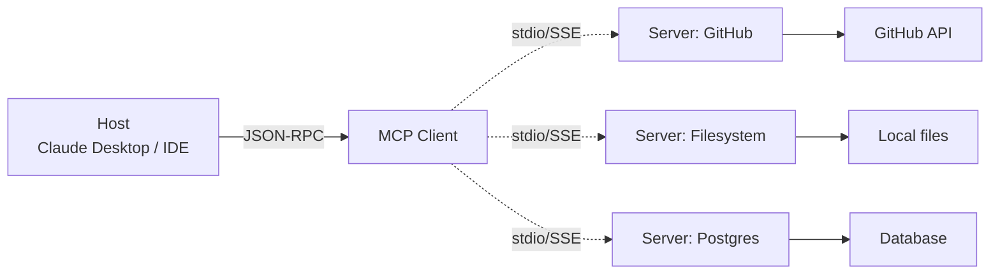

<KeyIdea>
**In one line**: MCP = **Model Context Protocol** — Anthropic-led open protocol between "model ↔ outside world." It exposes three resource types (tools, data, prompts) through a unified interface, so any MCP server can plug into any MCP client (Claude Desktop / IDE / your own agent).
</KeyIdea>

## What it is

Before MCP every product invented its own tool protocol (OpenAI's, Anthropic's, your platform's). MCP standardises:

- **Tools** — callable functions
- **Resources** — readable data (files, DB rows)
- **Prompts** — reusable prompt templates

A server exposes these; a client connects via stdio or WebSocket and the model immediately gains the new capability.

## Analogy

<Analogy>
- Before: every laptop had a **proprietary charging port** — a new adapter for every brand.
- MCP: **Type-C** — one cable, plug it anywhere.  
For models this means: **write a tool once, use it everywhere**.
</Analogy>

## Key concepts

<Terms items={[
  { term: "MCP Server", en: "MCP server", def: "A process that exposes Tools / Resources / Prompts. Can be local or remote-hosted." },
  { term: "MCP Client", en: "MCP client", def: "An MCP-aware host — Claude Desktop / Cursor / Cline / your own agent." },
  { term: "Transport", en: "Transport", def: "stdio (local subprocess) or SSE / WebSocket (remote). Messages are JSON-RPC 2.0." },
  { term: "Tool / Resource / Prompt", en: "Three resource kinds", def: "Tools are executable; Resources are readable (files, DB); Prompts are pre-defined templates." },
]} />

## How it works

The model reaches any server via Host → Client → Server. **Add one server and the whole ecosystem inherits the capability.**

## Practical notes

- **Spinning up a local server is trivial.** `npm i -g mcp-server-filesystem` and one line of `claude_desktop_config.json` lets Claude read your machine.
- **Official / community servers cover a lot.** GitHub, Slack, Postgres, Notion, Brave Search, Puppeteer — **try off-the-shelf before writing your own**.
- **Use the official SDK to write servers.** `mcp` (Python) / `@modelcontextprotocol/sdk` (TS) — a few dozen lines and you're up.
- **Scope permissions tightly.** MCP servers run locally and can read files / call APIs — **principle of least privilege**, otherwise a malicious prompt-injection can pivot through them.
- **Not all-or-nothing.** Stay on Function Calling internally, and **adopt MCP for the surfaces you want to open up**.

## Easy confusions

<Compare
  leftTitle="MCP"
  rightTitle="Function Calling"
  left={<>
    A **vendor-neutral protocol**. 
    One server, every host.
  </>}
  right={<>
    A **per-model schema**. 
    Tools and model are tightly coupled.
  </>}
/>

<Compare
  leftTitle="MCP"
  rightTitle="OpenAPI / REST"
  left={<>
    **Designed for LLMs**: tool descriptions in natural language. 
    Native semantics for Resources and Prompts beyond pure functions.
  </>}
  right={<>
    APIs designed for human engineers / programs. 
    No LLM-friendly capability-discovery mechanism.
  </>}
/>

## Further reading

- [Function Calling](/ai/beginner/function-calling) — MCP's single-vendor cousin
- [Skills](/ai/beginner/skills) — Anthropic's other capability-bundling story
- [Code Interpreter](/ai/beginner/code-interpreter) — give the model "hands" without going through MCP
- Spec: [modelcontextprotocol.io](https://modelcontextprotocol.io)
