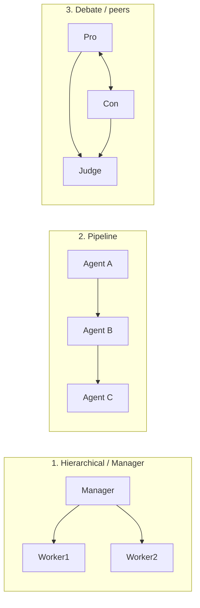

<KeyIdea>
**In one line**: Multi-Agent means **several agents with distinct system prompts collaborate via "conversation"**. Each agent has a role (PM / engineer / reviewer / QA) and they pass messages to complete a large task together.
</KeyIdea>

## What it is

A single agent doing everything ends up "jack of all trades, master of none." Multi-Agent splits the work across **specialised agents**:

```
PM Agent       → break requirements, write acceptance criteria
Coder Agent    → write code
Reviewer Agent → code review, find issues
Tester Agent   → write and run tests
```

They communicate through structured messages, scheduled by an **Orchestrator**.

## Analogy

<Analogy>
Single agent = **general handyman** — does everything, none of it great.  
Multi-Agent = **a real software team** — PM, frontend, backend, QA each owns their lane. **Specialisation + peer review = consistently higher quality.**
</Analogy>

## Key concepts

<Terms items={[
  { term: "Role", en: "Role", def: "Each agent has its own system prompt defining identity, responsibility, output format." },
  { term: "Orchestrator", en: "Orchestrator", def: "Decides who goes next and how messages flow — can be another agent or a fixed flow." },
  { term: "Conversation", en: "Conversation", def: "The message log between agents — the state itself." },
  { term: "Memory", en: "Shared / private memory", def: "A public whiteboard (shared) + each agent's notes (private)." },
]} />

## Three common topologies



- **Hierarchical**: manager decomposes, workers execute, manager aggregates. AutoGen GroupChat / CrewAI default.
- **Pipeline**: fixed order, each agent sees only the upstream output. Simple and stable.
- **Debate**: two opposing agents argue while a third arbitrates — **pushes quality up**.

## Practical notes

- **Don't start with 5 agents.** Get a single agent working first; **only split when one truly can't do the job**. Every extra agent adds context cost and failure probability.
- **Roles must be clear and non-overlapping.** "Reviewer only finds bugs, **doesn't write code**; Coder only writes, **doesn't review**." Overlap = chaos.
- **Structured messages.** Agents should not chat freely — use JSON like `{from, to, type, content}`. **Easier routing + logging + rate limiting.**
- **Add a "stop person."** Debate mode needs `max_rounds` or two agents will argue forever.
- **Prefer a shared whiteboard.** Have agents write to one markdown / DB rather than send N×N point-to-point messages.

## Easy confusions

<Compare
  leftTitle="Multi-Agent"
  rightTitle="Workflow + multiple prompts"
  left={<>
    Agents **converse autonomously**; the model decides who says what.<br />
    Flexible, but may go off track.
  </>}
  right={<>
    Humans pre-wire nodes and edges.<br />
    Different prompts per step, but **transitions are fixed**.
  </>}
/>

## Further reading

- [Agent](/ai/beginner/agent) — the single-agent foundation
- [Workflow](/ai/beginner/workflow) — Multi-Agent's deterministic counterpart
- [Planning](/ai/beginner/planning) — the manager agent's core skill
- [LangGraph](/ai/ecosystem/langgraph) — the most common production multi-agent framework
