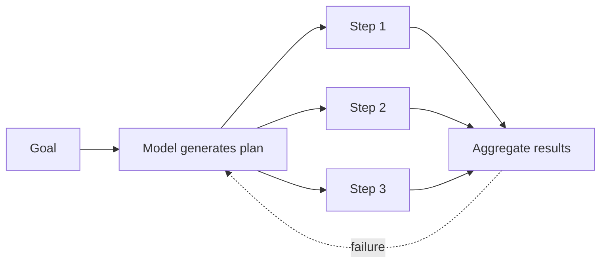

<KeyIdea>
**In one line**: Planning means letting an agent **decompose a big goal into actionable small steps first**, then execute them step by step — the bridge between "can chat" and "can actually deliver."
</KeyIdea>

## What it is

Complex tasks ("build me a SaaS landing page", "analyse this company's earnings") cannot be answered in one go. Planning breaks them down:

```
Goal: Build a SaaS landing page

Plan:
  1. Define the product positioning (talk to user)
  2. Draft an outline (Hero / Features / Pricing / FAQ)
  3. Write copy for each section
  4. Pick palette and fonts
  5. Emit the HTML
```

The agent then executes step by step, each step being a **smaller, more tractable sub-problem**.

## Analogy

<Analogy>
Planning is the **construction crew's work order**: "knock down walls first, then plumbing, then paint, then floors." Thinking the order through up front is **faster and less error-prone** than improvising on site.
</Analogy>

## Key concepts

<Terms items={[
  { term: "Plan", en: "Plan", def: "An ordered list of steps, each an executable sub-task." },
  { term: "Replan", en: "Replan", def: "When the current plan turns out infeasible mid-execution, regenerate a new plan from fresh observations." },
  { term: "Decomposition", en: "Decomposition", def: "Recursively break a big goal into a tree of sub-goals." },
  { term: "DAG / Graph", en: "Dependency graph", def: "Some steps in complex tasks can run in parallel; a graph reveals the dependencies." },
]} />

## Three mainstream patterns

### 1. ReAct (think-and-act)

Decide every step on the fly — **planning emerges naturally**. Simple but may zigzag with trial and error.

### 2. Plan & Execute

Emit the full plan first, then batch-execute it. **Saves Tokens, easier to observe**, but mid-flight errors trigger replanning.

### 3. ReWOO / LLMCompiler (async / parallel)

Compile the plan into a graph of parallel-executable nodes — **many tool calls run simultaneously**. Great for independent sub-tasks.



## Practical notes

- **Use only for complex tasks.** Simple Q&A — **don't plan**, you'll just add overhead.
- **Make the plan a schema.** Have the model emit JSON like `[{step, action, args}]` so a program can consume it cleanly.
- **Cap the step count.** Prevent over-decomposition — 5–10 steps is usually enough; beyond that, switch to multi-agent.
- **Validate the plan once after generation.** The cheapest Reflection trick: let the model look at its own plan and ask "**did I miss anything**?"
- **Replan on triggers, not every step.** Replanning every step is expensive — trigger only on tool failure or unexpected observation.

## Easy confusions

<Compare
  leftTitle="Planning (ad hoc)"
  rightTitle="Workflow (fixed)"
  left={<>
    **Steps generated by the model at runtime.**<br />
    Flexible, handles novel tasks.
  </>}
  right={<>
    **Steps defined by humans at design time.**<br />
    Stable; guarantees critical steps are reached.
  </>}
/>

## Further reading

- [ReAct](/ai/beginner/react) — the classic pattern with built-in planning
- [Multi-Agent](/ai/beginner/multi-agent) — once a plan is split, distribute steps across agents
- [Reflection](/ai/advanced/reflection) — self-check the plan's quality
