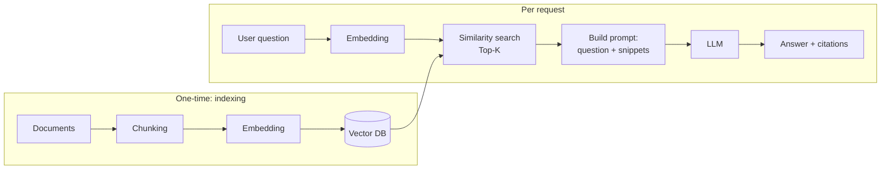

<KeyIdea>
**In one line**: RAG = **Retrieval-Augmented Generation**. First fetch relevant snippets from your own corpus, **then splice them into the prompt so the model answers from sources**. It is the industry-default way to give an LLM private knowledge, fresh data, or huge documents.
</KeyIdea>

## What it is

An LLM's built-in knowledge has a cutoff date and knows nothing about your private data. RAG does not touch the model weights — it **drops source material into the context on the fly**:

```
User: "What's our Q3 refund policy?"

[retrieve]  Pull the 3 most relevant snippets from the company knowledge base
[assemble]  Stuff snippets + question into the prompt
[generate]  Model writes the answer grounded in the snippets, with citations
```

Every answer is grounded in **the real material it was just shown** — update the knowledge base and the answer follows immediately.

## Analogy

<Analogy>
LLM without RAG = **closed-book exam** — relies on memory, gets things wrong.  
RAG = **open-book exam** — flip to the relevant page first, **copy the key bits, then write in your own words**. Accuracy jumps by an order of magnitude.
</Analogy>

## Key concepts

<Terms items={[
  { term: "Embedding", en: "Vectorisation", def: "Turn text into a vector so retrieval can match by semantic similarity, not just keywords." },
  { term: "Vector DB", en: "Vector database", def: "A DB that stores vectors and does fast nearest-neighbour search (pgvector / Milvus / Qdrant…)." },
  { term: "Chunking", en: "Splitting", def: "Break long documents into 200–800-character pieces that are easy to retrieve and feed to the model." },
  { term: "Top-K Retrieval", en: "Top-K", def: "Return the K (usually 3–10) most similar snippets." },
  { term: "Rerank", en: "Reranking", def: "Re-score the top-K with a more precise model so the best ones float to the top." },
]} />

## How it works



**Index once (offline)**, **query every time (online)**.

## Practical notes

- **Recall matters more than generation.** 80% of bad RAG answers come from "we never retrieved the right snippet". Tune retrieval first (chunking + embedding model + rerank), then tune the prompt.
- **Chunks must carry context.** A flat 500-character cut loses titles and section info. Prepending "document name + section heading" to each chunk usually delivers a huge quality jump.
- **Hybrid retrieval.** Run vector search + BM25 keyword search together, then rerank — currently the most reliable recipe.
- **Force citations.** Tell the model "every claim must be marked with `[^1]` referencing the snippet number" and refuse to answer when no snippet supports the claim — this **crushes hallucination rates**.
- **Top-K is not "bigger is better".** K = 3–5 is usually optimal. Too high a K stuffs noise into the prompt and **dilutes the correct answer**.

## Easy confusions

<Compare
  leftTitle="RAG"
  rightTitle="Fine-tuning"
  left={<>
    Injects material **at runtime**.<br />
    Content updates instantly; weights stay frozen.
  </>}
  right={<>
    Bakes knowledge into weights **at training time**.<br />
    Expensive and hard to refresh.
  </>}
/>

<Compare
  leftTitle="RAG"
  rightTitle="Long context (1M tokens)"
  left={<>
    Retrieves only **the relevant snippets**.<br />
    Cheap, fast, and scales out.
  </>}
  right={<>
    Stuffs **the whole corpus** in one shot.<br />
    Expensive, slow, and effective attention degrades.
  </>}
/>

## Further reading

- [Embeddings](/ai/beginner/embeddings) — the "semantic fingerprint" RAG runs on
- [Vector Database](/ai/beginner/vector-db) — the storage layer for embeddings
- [Chunking](/ai/beginner/chunking) — the slicing strategy that caps RAG quality
- [LangChain](/ai/ecosystem/langchain) / [LlamaIndex](/ai/ecosystem/llamaindex) — mainstream RAG frameworks
