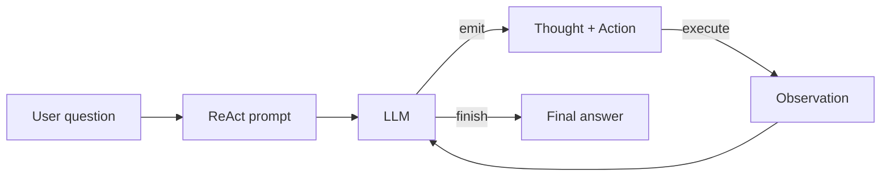

<KeyIdea>
**In one line**: ReAct = **Reason + Act**. The model alternates three blocks of text — **Thought → Action → Observation** — looping until the task is done. Today ~90% of agent frameworks (LangChain / OpenAI tools / Claude tools) are variants of this pattern under the hood.
</KeyIdea>

## What it is

Each round emits three blocks:

```
Thought: I need to know the weather in Beijing today; I should use the search tool.
Action:  search("Beijing weather today")
Observation: 26°C, cloudy.

Thought: The user asked whether they need an umbrella; I can answer now.
Action:  finish("No umbrella needed — cloudy today.")
```

Treat `Thought / Action / Observation` as a **structured log** generated by the model and looped back into the prompt — **every round bases its decision on the previous Observation**.

## Analogy

<Analogy>
ReAct is like **detective work**:
- **Reason** = hypothesise ("the suspect might be A because of motive");
- **Act** = collect evidence (verify A's alibi);
- **Observation** = receive the evidence;
- Then reason again — looping until the case is solved.
</Analogy>

## Key concepts

<Terms items={[
  { term: "Thought", en: "Thought", def: "The model thinks about the next step in natural language — CoT applied within a loop." },
  { term: "Action", en: "Action", def: "A structured tool call (Function Calling): which tool, what args." },
  { term: "Observation", en: "Observation", def: "The tool's return value, fed back to the model so it can continue." },
  { term: "Stop Condition", en: "Stop condition", def: "Explicit `finish()` from the model or hitting the max-step cap." },
]} />

## How it works



Each loop splices the **entire history** (all Thought / Action / Observation) back into the prompt — which is why agents devour context windows.

## Practical notes

- **Prefer native Tools APIs.** OpenAI / Anthropic / Gemini all expose `tools` fields with ReAct baked in — no need to hand-roll a parser.
- **One-line descriptions per tool.** Spell out "**when to use, required args, return shape**" — that line is what makes tool selection accurate.
- **Cap steps.** Hard limit 8–15. When stuck, error out or hand off to a human.
- **Keep Observations short.** A long JSON return immediately devours half the context. **Summarise / filter before feeding back.**
- **Don't expose Thought in production UI.** Reasoning chains belong in dev traces; the frontend should show "final answer + key action progress" only.

## Easy confusions

<Compare
  leftTitle="ReAct"
  rightTitle="Pure CoT"
  left={<>
    **Calls tools**, can change the outside world.<br />
    Multi-round loop, each step grounded in the previous.
  </>}
  right={<>
    **Thinks in head only**, doesn't change the world.<br />
    One-shot reasoning chain + answer.
  </>}
/>

<Compare
  leftTitle="ReAct"
  rightTitle="Plan & Execute"
  left={<>
    **Think and act simultaneously**, decide every step.<br />
    Good for branching, uncertain tasks.
  </>}
  right={<>
    **Plan all steps up front**, then execute in batch.<br />
    Good for stable flows, saves Tokens.
  </>}
/>

## Further reading

- [Agent](/ai/beginner/agent) — the overall framework
- [Function Calling](/ai/beginner/function-calling) — the protocol behind Action
- [Planning](/ai/beginner/planning) — Plan-and-Execute and other patterns
- [Reflection](/ai/advanced/reflection) — bolt a self-check stage onto ReAct
