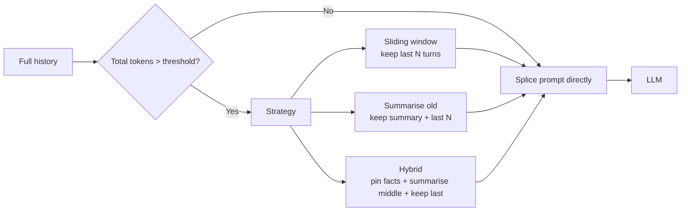

<KeyIdea>
**In one line**: Short-term memory = **the most recent few turns** of the current conversation. The model itself has no concept of "session" — every turn we splice the whole chat history back into the prompt, **making the model "think" it remembers**. Once total length exceeds the context window, you must decide **what to keep and what to drop**.
</KeyIdea>

## What it is

Every LLM call really sends:

```json
[
  {"role": "system", "content": "You are an assistant"},
  {"role": "user", "content": "My name is Mike"},
  {"role": "assistant", "content": "Hello Mike"},
  {"role": "user", "content": "What's my name?"}   ← current question
]
```

The model "remembers the name" purely because **earlier messages are still in the prompt**. Once the total length exceeds the window, older messages get cut and **the model "forgets"**.

## Analogy

<Analogy>
The model's "brain" = a **finite whiteboard**. Every turn we copy old notes back onto it, then add the current question.  
When the board fills up, **we have to erase old stuff** — short-term memory strategy is "**which bits to erase**."
</Analogy>

## Key concepts

<Terms items={[
  { term: "Sliding Window", en: "Sliding window", def: "Keep only the last N turns; drop older — simplest." },
  { term: "Summarization", en: "Summarisation", def: "Compress old turns into a summary, stuff back into the system prompt — saves tokens." },
  { term: "Token Budget", en: "Token budget", def: "Usable = context window − system prompt − tool defs − output reserve." },
  { term: "Pin Messages", en: "Pin messages", def: "Important facts (user name, preferences) always retained, never trimmed." },
]} />

## How it works



In production almost everyone uses **Hybrid**: pin key facts + summarise the middle + keep the last 5–10 turns.

## Practical notes

- **Track total tokens.** Context window is not free — **system + history + tools + output reserve** all count.
- **Give summaries a format.** Have the model "**emit 3 lines of markdown bullets capturing key facts**" — far more stable than "summarise freely."
- **Extract important facts immediately.** When the user says "**I'm allergic to peanuts**", **extract it on the spot** into the system prompt — don't rely on future summarisation.
- **Don't store raw tool output.** Multi-KB JSON instantly devours context. **Summarise before feeding back.**
- **For long tasks, use LangGraph or a checkpointed lib.** Hand-rolling history splicing is a bug magnet.

## Easy confusions

<Compare
  leftTitle="Short-term"
  rightTitle="Long-term"
  left={<>
    **Within the current session.**<br />
    Just messages in the prompt.
  </>}
  right={<>
    **Across sessions, persisted.**<br />
    Stored in DB / vector store; pulled back next session.
  </>}
/>

<Compare
  leftTitle="Short-term memory"
  rightTitle="Context Window"
  left={<>
    **Application strategy** — how to fit into the window.
  </>}
  right={<>
    **Model attribute** — how big the window itself is.
  </>}
/>

## Further reading

- [Context Window](/ai/beginner/context-window) — short-term memory's hard cap
- [Long-term Memory](/ai/beginner/long-term-memory) — across-session persistence
- [RAG](/ai/beginner/rag) — when history is too long, retrieve old turns instead
