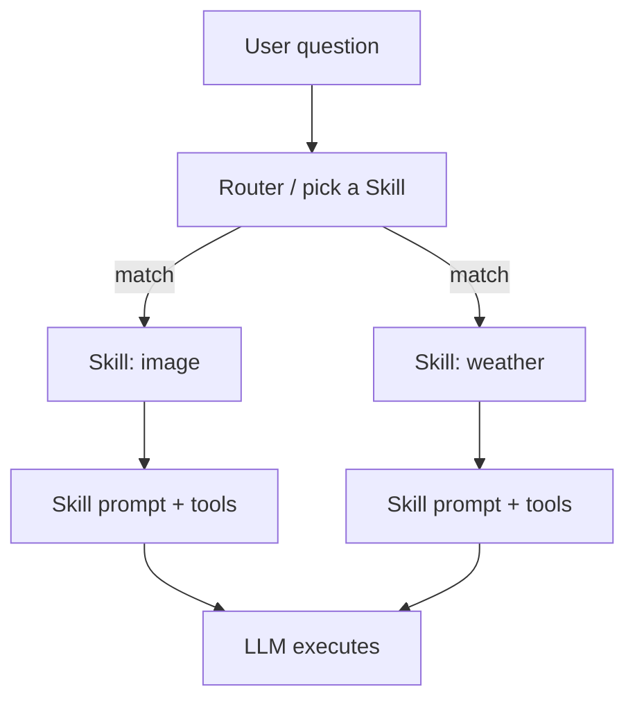

<KeyIdea>
**In one line**: A Skill is a **capability bundle** — it packages everything one task needs (**system prompt + tool list + examples + resources**) into a single unit. Install a Skill and the agent "knows how" to do the task; uninstall it and the ability disappears.
</KeyIdea>

## What it is

A few intuitive examples:

- **Image Skill** — a prompt teaching the model how to write Stable Diffusion prompts plus a `gen_image` tool.
- **Weather Skill** — a `get_weather` tool plus a "**how to interpret weather**" prompt.
- **PDF-reader Skill** — a `read_pdf` tool plus examples on how to summarise papers.

Install N Skills into an agent and it gains all N specialisations simultaneously.

## Analogy

<Analogy>
The agent is the **phone**; Skills are **apps**.  
- Install the food-delivery app and it can order food.  
- Uninstall it and that ability vanishes.  
Anthropic's Skills, Coze's "plugins", Dify's "Tool Sets" are all variants of the same idea.
</Analogy>

## Key concepts

<Terms items={[
  { term: "Skill Manifest", en: "Manifest", def: "A YAML / JSON: name + description + trigger conditions + resource list." },
  { term: "Bound Tools", en: "Bound tools", def: "The function calls a Skill ships with (APIs, MCP servers, local code)." },
  { term: "Skill Prompt", en: "Skill prompt", def: "Skill-private system addendum, spliced in only when the Skill is active." },
  { term: "Activation", en: "Activation", def: "Triggered by user choice / a manager-agent router / keyword match." },
]} />

## How it works

**One agent + many Skills** = lightweight multi-agent — same LLM, **costumes** swapped per task.

## Practical notes

- **One Skill, one job.** Don't cram "summarise documents" + "generate charts" into a single Skill. **Single responsibility = better routing, easier debugging.**
- **Skill descriptions drive routing.** Like Function descriptions, write clearly "**when to use, what it can do, what it can't**."
- **Skills can compose.** Complex capabilities ("write a product launch email") = writing Skill + chart Skill + proofreading Skill.
- **Hot-pluggable.** A good Skill system **adds / removes Skills at runtime** without restarting the agent.
- **Audit / bill per Skill.** Track Tokens and call counts per Skill so issues can be localised quickly.

## Easy confusions

<Compare
  leftTitle="Skill"
  rightTitle="Tool / Function"
  left={<>
    **Capability bundle**: prompt + N tools + examples + resources.
  </>}
  right={<>
    **A single atomic action**: one function. 
    Skill is the higher-level wrapper around tools.
  </>}
/>

<Compare
  leftTitle="Skill"
  rightTitle="Multi-Agent"
  left={<>
    **Same agent, costume change.** 
    Shared context, cheap, lightweight.
  </>}
  right={<>
    **Multiple independent agents** conversing. 
    Strong isolation and specialisation, but costly.
  </>}
/>

## Further reading

- [Function Calling](/ai/beginner/function-calling) — what Skills' inner tools really are
- [MCP](/ai/beginner/mcp) — Skills can be repackaged as MCP servers for cross-product reuse
- [Multi-Agent](/ai/beginner/multi-agent) — when Skills aren't enough
- [Dify / Coze](/ai/ecosystem/dify-coze) — platforms that visualise Skills
