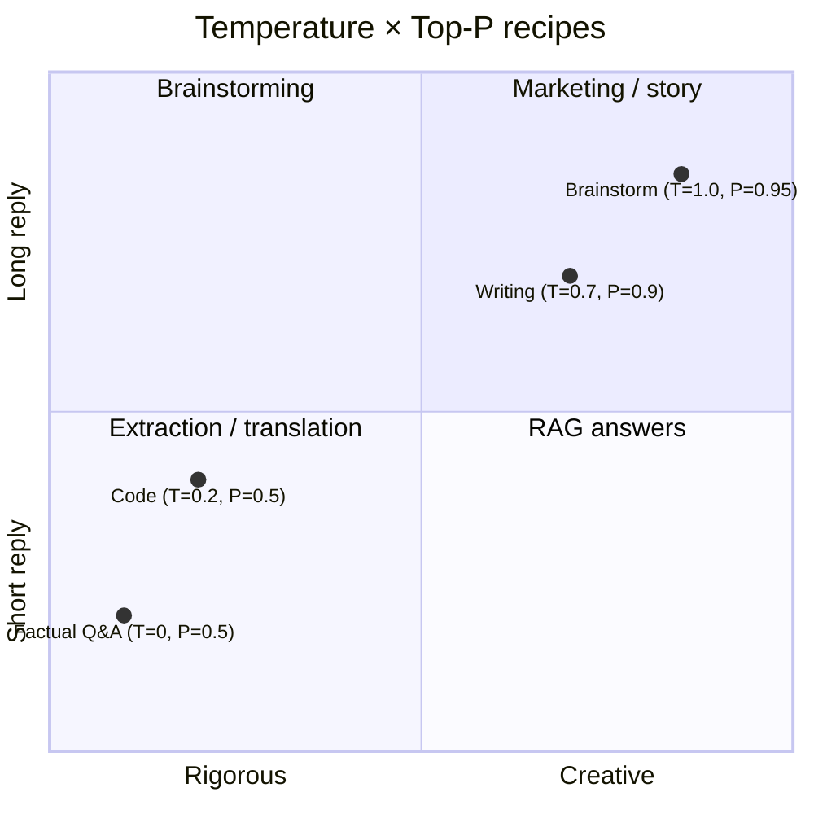

<KeyIdea>
**In one line**: Temperature controls **how bold the model is** (higher = more random); Top-P controls **how big the candidate pool it samples from is** (smaller = only the safest few). Both let you slide between **rigorous & deterministic ↔ flexible & creative**.
</KeyIdea>

## What it is

For every Token it generates, the model computes a probability distribution over the vocabulary, then samples:

```
Token candidate    Probability
"clear"            0.42
"sunny"            0.28
"cool"             0.10
"…"                0.20
```

**Temperature** changes the *sharpness* of this distribution; **Top-P** changes *how big the pool of candidates is*.

## Analogy

<Analogy>
- **Temperature** = the conductor's "variation knob." 0 = recite the score verbatim; 1 = improvised jazz; >1 = drifting off-key.
- **Top-P** = "only the menu's top-N best-sellers." Top-P 0.1 = consider only the two or three most popular dishes; 0.95 = almost everything is fair game.
</Analogy>

## Key concepts

<Terms items={[
  { term: "Temperature 0", en: "Deterministic", def: "Always picks the highest-probability Token. Same input → same output, every time." },
  { term: "Temperature 0.7", en: "Default creative", def: "OpenAI / most chat APIs' default. Natural with reasonable variation." },
  { term: "Temperature 1.5+", en: "Nonsense zone", def: "High randomness; risks tangents, off-topic jumps, even misspellings." },
  { term: "Top-P 0.1", en: "Conservative sampling", def: "Only picks from candidates whose cumulative probability hits 10%. Nearly deterministic." },
  { term: "Top-P 1.0", en: "Wide open", def: "The whole vocab is in play. Combined with high temperature, freewheeling output." },
]} />

## How to combine them



Empirical defaults:

| Task | Temperature | Top-P |
|---|---|---|
| Extraction / SQL / JSON | 0 – 0.2 | 0.5 |
| RAG Q&A / translation | 0.2 – 0.4 | 0.7 |
| Copywriting / prose | 0.6 – 0.8 | 0.9 |
| Brainstorming / story | 0.9 – 1.2 | 0.95 |

## Practical notes

- **One knob is enough.** In practice, **just adjust temperature**. Leave Top-P at 1.0 unless you need extreme determinism.
- **Cooler for rigorous tasks.** Entity extraction, schema generation, SQL — `T=0` is the most reproducible.
- **High temperature needs guardrails.** At `T=1`, pin the length and structure in the system prompt, otherwise the output will drift.
- **Doesn't affect RAG quality.** Temperature only changes sampling — **not retrieval**. Bad RAG is almost always bad prompts / chunking, not temperature.

## Easy confusions

<Compare
  leftTitle="Temperature"
  rightTitle="Top-P"
  left={<>
    Changes the **sharpness of the whole distribution**.<br />
    Every candidate stays in the running; weaker candidates' odds shift.
  </>}
  right={<>
    Changes the **size of the candidate pool**.<br />
    Tokens outside the pool are forcibly set to probability zero.
  </>}
/>

<Callout type="tip" title="Tweaking both?">
Both compress randomness. **Usually only change one** so you don't end up wondering "which knob is at what value?"
</Callout>

## Further reading

- [System Prompt](/ai/beginner/system-prompt) — constraints + low temperature = the most stable output
- [Hallucination](/ai/beginner/hallucination) — low temperature won't save you from fundamental fabrication
- [CoT](/ai/beginner/cot) — make reasoning steadier even at high temperature
