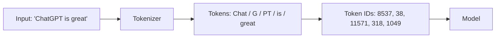

<KeyIdea>
**In one line**: A Token is the LLM's smallest "building block" of text — not a character, not a word, but **a fragment of characters pre-baked into the model's vocabulary**. Reading, writing, billing, and length limits all happen in Tokens.
</KeyIdea>

## What it is

An LLM does not consume human text directly. It first splits the text into a sequence of Tokens, then maps each Token to an integer ID. Common splitters (**BPE**, **SentencePiece**) keep frequent character strings whole and slice rare ones into pieces, so:

- English: 1 Token ≈ 0.75 words
- Chinese: 1 Token ≈ 1–2 characters
- Code / emoji / rare characters: a single character may become multiple Tokens

## Analogy

<Analogy>
Your brain reads "today's weather is great" character by character. The model reads it as **"today / 's / weather / is / great"** — each chunk is a Token.
</Analogy>

## Key concepts

<Terms items={[
  { term: "Token ID", en: "Vocabulary index", def: "Every Token has a unique integer in the vocab (GPT's vocab is ~100K tokens)." },
  { term: "BPE / WordPiece", en: "Splitting algorithm", def: "Keeps frequent strings whole and breaks down rare ones — balancing **compression and full coverage**." },
  { term: "Special Tokens", en: "Special markers", def: "<bos> / <eos> / <pad> / <system>, marking start, end, and chat roles." },
  { term: "Token billing", en: "Pricing model", def: "APIs charge per input + output Token. Long contexts get expensive fast." },
]} />

## How it works

The splitter is fixed before training — **every user shares the same vocabulary**.

## Practical notes

- **Estimating Token count**: for English, "words × 1.3"; for Chinese, "characters × 1.5". Good enough to ballpark API cost.
- **Saving Tokens**: trim filler in prompts; compress tabular data into JSON/CSV; summarise long documents before feeding them in.
- **Watch out for rare characters**: emoji, traditional-Chinese rare glyphs, obscure code symbols often each become several Tokens — **lengths blow up easily**.
- **Tokenizers are not interchangeable**: GPT-4's splitter differs from Claude / Qwen / Llama. The same paragraph can vary by 30% in Token count.

## Easy confusions

<Compare
  leftTitle="Token (LLM view)"
  rightTitle="Word / Character (human view)"
  left={<>
    A **pre-defined string fragment** in the model's vocabulary. 
    Could be half a word, a whole word, or several words.
  </>}
  right={<>
    The smallest semantic unit of natural language. 
    Has **no one-to-one mapping** to the model's vocabulary.
  </>}
/>

<Callout type="tip" title="Count your own Tokens">
OpenAI's [tokenizer page](https://platform.openai.com/tokenizer) lets you paste text and see the split. In Python, `tiktoken` computes it in one line.
</Callout>

## Further reading

- [Context Window](/ai/beginner/context-window) — how many Tokens you can fit at once
- [Parameters](/ai/beginner/parameters) — model size vs Token throughput
- [Chunking](/ai/beginner/chunking) — slicing long documents into Token-friendly pieces for RAG
