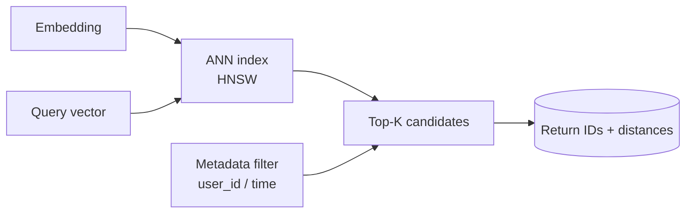

<KeyIdea>
**In one line**: A vector database is a DB **purpose-built to store vectors and query nearest neighbours fast**. The core problem it solves: out of millions to billions of vectors, find the K most similar to a query vector — in **milliseconds**.
</KeyIdea>

## What it is

A regular SQL database can't do this — "find 5 with highest cosine similarity over 1536-d vectors" requires a full scan; at a million rows it falls over. Vector DBs use ANN indexes (HNSW / IVF / DiskANN) to bring it down to **O(log N)**:

```sql
-- pgvector
SELECT id, content
FROM docs
ORDER BY embedding <=> $query_vector
LIMIT 5;
```

`<=>` is cosine distance — accelerated by the index, **returning in milliseconds**.

## Analogy

<Analogy>
A regular DB is the **phone book** — find a record by name (key).  
A vector DB is **map + radar** — give a coordinate; the radar **sweeps for the nearest points**.
</Analogy>

## Key concepts

<Terms items={[
  { term: "ANN Index", en: "ANN index", def: "HNSW / IVF / DiskANN — trade a sliver of accuracy for huge speed." },
  { term: "Metric", en: "Distance metric", def: "Cosine / Euclidean / dot product — must match what the embedding model was trained for." },
  { term: "Filter", en: "Metadata filter", def: "Filter by fields (user_id / time / category) alongside vector search." },
  { term: "Hybrid Search", en: "Hybrid search", def: "Combine vector + keyword (BM25) and rerank." },
]} />

## Mainstream options

| Option | Notes | Best for |
|---|---|---|
| **pgvector** | Postgres extension, zero adoption cost | Up to ~tens of millions, when PG is already in stack |
| **Qdrant / Milvus / Weaviate** | Dedicated, strong filters + hybrid | Billions / production |
| **Pinecone** | Fully managed SaaS | Don't want to operate it yourself |
| **FAISS / Chroma** | Single-machine libs, local experiments | Prototypes / offline |
| **OpenSearch / Elasticsearch** | BM25 + vectors together | Existing ES cluster |

## How it works



The index stores high-dimensional space as **partitions + neighbour graphs** — queries only scan local regions.

## Practical notes

- **Try pgvector first.** From thousands to tens of millions, pgvector is enough. **Don't reach for a Milvus cluster on day one.**
- **Metric must align.** If the embedding model trains under cosine, query under cosine. Mismatch tanks recall.
- **Store metadata with vectors.** Bind each vector to `{doc_id, chunk_idx, user_id, source, time}` and **filter at query time**.
- **Batch inserts.** Inserting 1 vs 1000 at a time can differ by 30–100× in index-build speed.
- **Monitor recall.** Run a "golden question set" regularly — **immediately verify after upgrading embeddings or chunk size**.

## Easy confusions

<Compare
  leftTitle="Vector DB"
  rightTitle="Search engine (ES)"
  left={<>
    **Find by semantics.**<br />
    Understands synonyms and fuzzy meanings.
  </>}
  right={<>
    **Find by literal match** (BM25).<br />
    Strong on exact entities.
  </>}
/>

Hybrid retrieval = both → **the most reliable RAG recall**.

## Further reading

- [Embeddings](/ai/beginner/embeddings) — where the vectors come from
- [RAG](/ai/beginner/rag) — the vector DB's biggest application
- [Chunking](/ai/beginner/chunking) — pre-processing before writing to the vector DB
