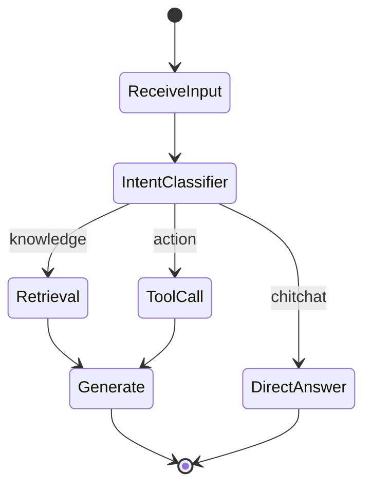

<KeyIdea>
**In one line**: A workflow turns an AI app into a **graph of nodes** — each node is one operation (LLM call, tool, condition, DB write), connected by edges. **The flow shape, the step count, the prompt at each step are defined by humans in advance**; the model only "performs" inside individual nodes.
</KeyIdea>

## What it is

The opposite of "let the model decide the next step":

```
[receive question] → [intent classifier] → [branch]
                                            ├─ FAQ      → [RAG] → [generate]
                                            ├─ Support  → [order API] → [write reply]
                                            └─ Chitchat → [direct answer]
```

**Every node and every edge is pinned at design time.** At runtime data flows through the graph.

## Analogy

<Analogy>
Agent = **freelancer** — say "handle this" and they pick their own steps.  
Workflow = **factory line** — every station's job and the handoff between them are fixed by the operator. **Predictable, reliable yield.**
</Analogy>

## Key concepts

<Terms items={[
  { term: "Node", en: "Node", def: "An atomic operation: LLM call, API hit, DB write, conditional…" },
  { term: "Edge", en: "Edge", def: "Routing rule between nodes. Can be conditional (if), parallel, or looping." },
  { term: "State", en: "State", def: "Data passed between nodes — typically a JSON dict that gets patched along the way." },
  { term: "Checkpoint", en: "Checkpoint", def: "Persist state so long tasks can pause, resume, or pull in a human approver." },
]} />

## How it works



**Every edge is pinned at design time** — the model can't skip nodes or invent new branches.

## Practical notes

- **If you can draw the flow, use a workflow.** B2B business processes, support, approvals — places where the flow is clear, workflow is **a thousand times more stable** than agent.
- **Small, single-purpose nodes.** When a prompt grows out of control, split into two nodes — **far easier to debug than one mega-prompt**.
- **Human-in-the-loop.** For critical nodes (orders, refunds, emails) checkpoint and wait for human approval before continuing.
- **Draw failure branches too.** Each node needs retry / fallback / human escalation. **Don't let a flow silently die at one bad call.**
- **Workflow + Agent hybrid.** Lock the main flow with workflow, **let an agent handle a flexible sub-task inside one node**. The most common production pattern.

## Easy confusions

<Compare
  leftTitle="Workflow (deterministic)"
  rightTitle="Agent (flexible)"
  left={<>
    Flow is **human-defined**; model just acts inside nodes.<br />
    Observable, replayable, SLA-able.
  </>}
  right={<>
    Flow is **model-decided**; every step is improvised.<br />
    Flexible, hard to guarantee 99.9% reliability.
  </>}
/>

## Further reading

- [Agent](/ai/beginner/agent) — Workflow's opposite-twin
- [Multi-Agent](/ai/beginner/multi-agent) — run an agent team inside a workflow node
- [LangGraph](/ai/ecosystem/langgraph) — the de-facto standard for code-defined workflows
- [Dify / Coze](/ai/ecosystem/dify-coze) — GUI platforms for drawing workflows
