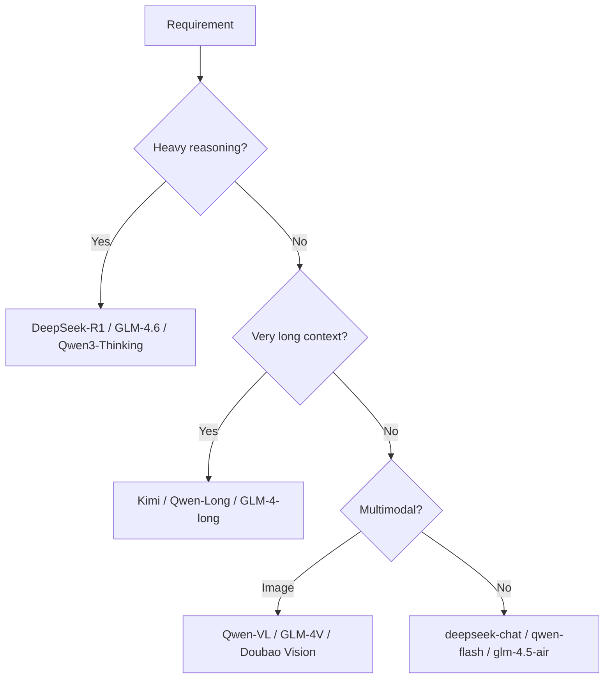

<KeyIdea>
**In one line**: DeepSeek / Qwen / GLM / Kimi are the most-used LLM APIs from China — **OpenAI-compatible, 5–20× cheaper than Western counterparts, locally compliant**. Each has its own niche: DeepSeek for strong reasoning, Qwen for breadth + open-weights, GLM for balanced bilingual + multimodal, Kimi for very long context.
</KeyIdea>

## Vendor cheat sheet

<KV items={[
  { k: "DeepSeek", v: "deepseek-chat (V3 family) + deepseek-reasoner (R1 family). Price/performance king. Full tools / json mode." },
  { k: "Qwen / Tongyi", v: "qwen-max / qwen-plus / qwen-flash + open-weights Qwen3 / Qwen-VL / Qwen-Coder. The richest ecosystem." },
  { k: "Zhipu GLM", v: "GLM-4.6 (reasoning) / GLM-4.5-Air (lightweight) / GLM-4V (multimodal) / CodeGeeX. Balanced ZH/EN; strong on agent tasks." },
  { k: "Moonshot Kimi", v: "k2 / moonshot-v1-* — early king of long context (128k–200k)." },
  { k: "MiniMax", v: "abab series + video gen. Multimodal-leaning." },
  { k: "Doubao", v: "ByteDance, fast, full text + vision lineup." },
  { k: "Hunyuan / Pangu / Spark", v: "Tencent / Huawei / iFlytek in-house models." },
  { k: "SiliconFlow / Volcano Ark / DashScope", v: "Aggregator services — one account, many vendors." },
]} />

## Analogy

<Analogy>
Different APIs are like different **food-delivery platforms**: menus (models) are similar; **prices, delivery speed, promos** vary. The same dish (capability) on a different platform may cost half as much.
</Analogy>

## Code examples

```python
from openai import OpenAI

# DeepSeek
ds = OpenAI(base_url="https://api.deepseek.com/v1", api_key="sk-...")
ds.chat.completions.create(model="deepseek-chat", messages=[...])
# Reasoning model uses a different model name
ds.chat.completions.create(model="deepseek-reasoner", messages=[...])

# Qwen (compatibility mode)
qw = OpenAI(
    base_url="https://dashscope.aliyuncs.com/compatible-mode/v1",
    api_key="sk-...")
qw.chat.completions.create(model="qwen-plus", messages=[...])

# Zhipu GLM
zp = OpenAI(base_url="https://open.bigmodel.cn/api/paas/v4", api_key="...")
zp.chat.completions.create(model="glm-4.6", messages=[...])

# Kimi
km = OpenAI(base_url="https://api.moonshot.cn/v1", api_key="sk-...")
km.chat.completions.create(model="moonshot-v1-32k", messages=[...])
```

## Key differences

<Terms items={[
  { term: "Reasoning mode", en: "Reasoner / Thinking", def: "DeepSeek-R1, GLM-4.6, Qwen3 thinking — `delta` contains an extra `reasoning_content` field." },
  { term: "Context length", en: "Context", def: "Kimi pioneered 128k; today Qwen3 / GLM / DeepSeek mainstream is 128k–256k." },
  { term: "JSON / Tools", en: "Structured output", def: "Mostly OpenAI-compatible schemas; minor field differences need testing." },
  { term: "Multimodal", en: "Vision / Audio", def: "Qwen-VL, GLM-4V, Doubao, Kimi-VL all support images; video/audio is catching up fast." },
  { term: "Compliance", en: "ICP / data residency", def: "Chinese vendors store data domestically — required for consumer apps shipping in China." },
  { term: "Rate limits", en: "Rate limit", def: "Per balance / tier; check docs before scaling." },
]} />

## Choosing



Prices change frequently; **A/B for a week** when picking.

## Practical notes

- **Gateway abstraction.** One wrapper, route per business / task. Model swaps touch one place.
- **Local fallback.** When the cloud fails, drop to local vLLM / Ollama with the open-weights variant (Qwen / DeepSeek / GLM are all available).
- **Hybrid pipelines.** Strong reasoner (DeepSeek-R1 / GLM-4.6) plans, small model (qwen-flash) executes high-volume calls.
- **Enterprise**: Volcano Ark / Aliyun DashScope / Tencent TI offer aggregation + private deployments with SLAs.
- **Safety prompts**: Chinese models are stricter on political / sensitive topics; **avoid triggers** in prompts.
- **Batch tasks.** DeepSeek and Qwen offer batch APIs at **half price**.

## Easy confusions

<Compare
  leftTitle="API call (online)"
  rightTitle="Open-weights (self-hosted)"
  left={<>
    No ops, billed per token.<br />
    Fastest to launch.
  </>}
  right={<>
    Deploy Qwen / DeepSeek / GLM yourself.<br />
    Data stays on-prem; you manage the GPUs.
  </>}
/>

## Further reading

- [OpenAI-Compatible API](/ai/ecosystem/openai-compatible)
- [vLLM](/ai/ecosystem/vllm)
- [HuggingFace](/ai/ecosystem/huggingface)
