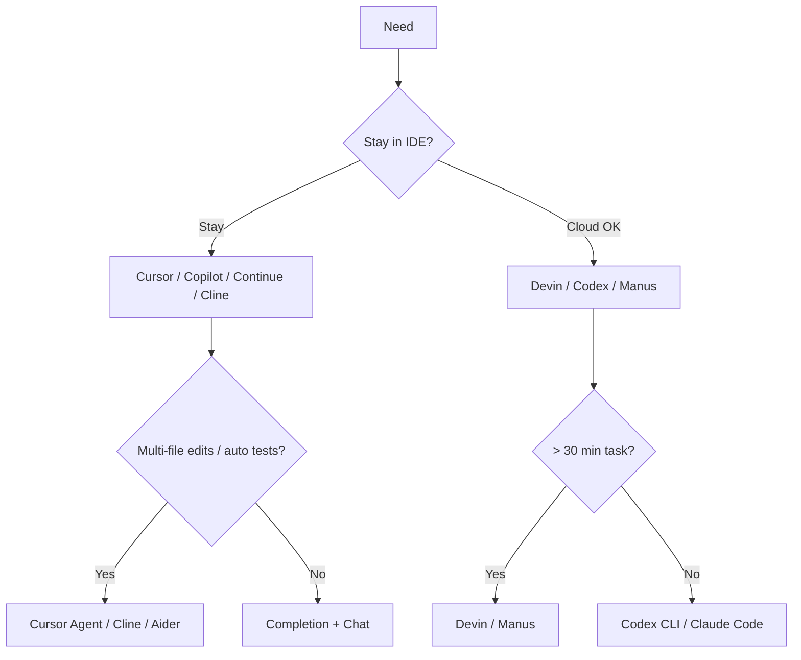

<KeyIdea>
**In one line**: In a year, coding agents went from "**Tab completion**" to "**reading repos + editing many files + running tests**". Cursor / Windsurf are IDEs; Cline / Continue / Aider are VSCode plugins + CLIs; Devin / OpenAI Codex are cloud agents.
</KeyIdea>

## Cheatsheet of mainstream tools

<KV items={[
  { k: "Cursor / Windsurf", v: "VSCode forks — **full-featured IDE**: tab completion, Chat, multi-file Agent, Terminal Agent. Subscription." },
  { k: "GitHub Copilot", v: "VSCode/JetBrains plugins + cloud IDE. Completion + Chat + Workspace Agent." },
  { k: "Cline / Roo Code", v: "VSCode plugins with built-in agent loop (read → edit → run → observe). BYO API." },
  { k: "Continue", v: "Open-source VSCode/JetBrains plugin; freely configurable backend." },
  { k: "Aider", v: "CLI + git-diff style — **fits the git workflow**." },
  { k: "Devin / Manus / Genspark", v: "Cloud-native true agents with browser + shell + IDE; can run hours-long tasks." },
  { k: "OpenAI Codex CLI / Claude Code", v: "Local CLI agents." },
  { k: "JetBrains AI / Junie", v: "JetBrains' first-party agent across the JetBrains family." },
]} />

## Analogy

<Analogy>
**Tab completion** = type half a sentence, it finishes;  
**Chat-in-IDE** = an intern next to you answering questions;  
**Agent-in-IDE** = the intern reads the project, edits files, runs tests, opens a PR;  
**Cloud agent** = you hand them the task and **they work overnight on their own machine**.
</Analogy>

## Key capability comparison

<Terms items={[
  { term: "Repo Map / Indexing", en: "Repo map", def: "Embed + structure the whole repo so the model can 'jump to definition'. Cursor / Cline both have this." },
  { term: "Tool Use", en: "Tool use", def: "shell / file-edit / browser / git. Determines how much an agent can actually do." },
  { term: "Diff-based Edit", en: "Diff editing", def: "Aider / Cline use diffs instead of full-file overwrite — **token-efficient + easy to revert**." },
  { term: "Context Compression", en: "Context compression", def: "For long tasks: keep relevant context via summaries / retrieval." },
  { term: "BYO Model", en: "Bring-your-own model", def: "Cline / Continue / Aider freely swap OpenAI / Claude / DeepSeek / local." },
  { term: "MCP", en: "Model Context Protocol", def: "Anthropic's standard for LLM-tool integration. Cursor / Cline / Claude Desktop all support it." },
]} />

## Choosing

## Practical notes

- **Rule one**: give agents tasks with **clear verification** (lint / tests / build pass = done) to reduce hallucination.
- **Small tasks → local IDE agent.** Cline + DeepSeek-V3 / Claude / GPT-4o handles routine code.
- **Large / long tasks → cloud agent.** Devin / Manus run in their own environments — **parallel + persistent** beats local.
- **Wire MCP servers**: filesystem / git / web-search / DB query — tools cap agent capability.
- **Code review is the floor.** All agent edits go through PR; **never push to main directly**.
- **Cost control**: cheap model for tab completion, strong model for big changes — tier within one project.
- **Privacy / compliance**: private repos → "no-train / data-residency" services, or self-host + local / private API.

## Easy confusions

<Compare
  leftTitle="Tab completion (early Copilot)"
  rightTitle="Agent-in-IDE"
  left={<>
    Single-point inline continuation. 
    Reactive to your current cursor.
  </>}
  right={<>
    Actively reads repo + edits many files + runs commands. 
    "Hand it the entire task."
  </>}
/>

## Further reading

- [Agent intro](/ai/beginner/agent)
- [MCP](/ai/beginner/mcp)
- [Function Calling](/ai/beginner/function-calling)
