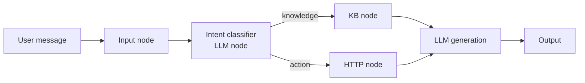

<KeyIdea>
**In one line**: Dify (open-source) and Coze (ByteDance, mostly cloud) put **RAG, Workflow, Tools, Agent** behind a graphical canvas. **Business / product / ops** people can drag-and-drop a working agent — not every line has to come from an engineer.
</KeyIdea>

## What it is

Inside the web UI you see:

- **Left**: node library (LLM node, knowledge-base node, HTTP node, conditional node, variable node)
- **Centre**: a canvas where you connect nodes
- **Right**: a debug panel — feed inputs, watch each node's output
- **Top**: publish → become an API / embeddable widget / WeChat bot

```
[Input] → [Intent classification] → [KB retrieval] → [LLM generation] → [Output]
                                ↘ [HTTP call to Order API] ↗
```

The whole pipeline is **codeless**.

## Analogy

<Analogy>
- LangGraph = **assemble Lego with code** — flexible, requires coding.  
- Dify / Coze = **a packaged Lego Friends kit** — instructions on the box, all parts compatible. **Not everyone wants to operate the factory.**
</Analogy>

## Key concepts

<Terms items={[
  { term: "App / Agent / Workflow", en: "Three app types", def: "App = single-prompt chat; Agent = tool loop; Workflow = freeform graph." },
  { term: "Knowledge", en: "Knowledge base", def: "Upload docs → auto-chunk + embed + vector store. One-stop RAG." },
  { term: "Tools / Plugins", en: "Tool marketplace", def: "Hundreds of built-ins: search, image gen, code, HTTP, API calls…" },
  { term: "Variables / Branches", en: "Variables / branches", def: "Node outputs are referenced; canvas supports conditional branches and loops." },
  { term: "Self-host vs Cloud", en: "Self-host vs cloud", def: "Dify is fully open-source and self-hostable; Coze is primarily SaaS." },
]} />

## Main options

| Platform | Deployment | Best for | Strength |
|---|---|---|---|
| **Dify** | Self-host / SaaS | Teams + data-sensitive scenarios | Open-source, strong workflow, enterprise-ready |
| **Coze (CN / international)** | SaaS | Chinese ecosystem / Douyin / Feishu bots | Models + channels integrated |
| **n8n + AI nodes** | Self-host | Already use n8n for automation | Generic automation + AI |
| **Flowise / LangFlow** | Self-host | Want LangChain visualised | Directly draws LangChain graphs |

## How it works



Visual platforms are **Workflow + Agent + RAG underneath** — the same primitives as LangGraph, just packaged as a canvas.

## Practical notes

- **Visual is best for business / ops.** PMs can edit prompts and add nodes themselves — **10× faster than filing a ticket and waiting for a release**.
- **Complex backends still hybrid.** Run the core in LangGraph; expose Dify as the **orchestration layer to business** — best of both.
- **Dify self-host suits B2B.** Customer data stays on their infra; the OSS edition has enough features.
- **Coze plays a "whole-stack" game.** Models, plugins, distribution channels (Douyin / Feishu / Telegram) all integrated — **fastest path for "I want a bot, not technology."**
- **Export workflow JSON when possible.** Version control, cross-env migration, disaster backup.

## Easy confusions

<Compare
  leftTitle="Visual platform"
  rightTitle="Code framework"
  left={<>
    **Drag + configure.**<br />
    Business / product can edit.
  </>}
  right={<>
    **Write code.**<br />
    Engineer-only, but maximally flexible.
  </>}
/>

<Compare
  leftTitle="Dify / Coze"
  rightTitle="ChatGPT GPTs"
  left={<>
    Generic platform — multi-model + multi-channel + self-host.
  </>}
  right={<>
    Embedded in OpenAI — only inside ChatGPT.<br />
    Wide reach, limited extensibility.
  </>}
/>

## Further reading

- [Workflow](/ai/beginner/workflow) — what's underneath the canvas
- [Skills](/ai/beginner/skills) / [Function Calling](/ai/beginner/function-calling) — the basis for plugins
- [LangGraph](/ai/ecosystem/langgraph) — same idea, in code
- Sites: [dify.ai](https://dify.ai) / [coze.com](https://www.coze.com)
