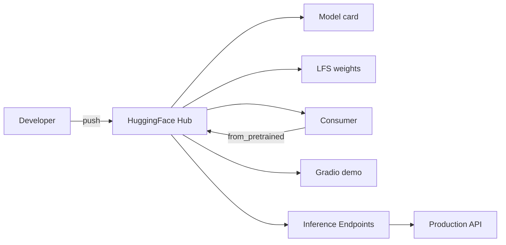

<KeyIdea>
**In one line**: HuggingFace (HF) is open-source AI's **central registry + app store**. Models, datasets, Spaces (live demos), Transformers / Datasets / PEFT / TRL / Accelerate libraries — half of all open-source LLM work goes through it.
</KeyIdea>

## Major parts

<KV items={[
  { k: "Hub (models + datasets + Spaces)", v: "huggingface.co — like GitHub: PRs / discussions / model cards." },
  { k: "transformers", v: "Python library that loads almost every model architecture (PyTorch / TF / Flax)." },
  { k: "datasets", v: "Standardised dataset loading, streaming, versioning." },
  { k: "tokenizers", v: "Rust-implemented fast tokenisers — BPE / Unigram / WordPiece." },
  { k: "accelerate", v: "Take single-GPU code to multi-GPU / multi-node / DeepSpeed / FSDP painlessly." },
  { k: "peft", v: "Standard implementation of LoRA / adapter / prefix tuning." },
  { k: "trl", v: "SFT / DPO / RLHF training framework." },
  { k: "evaluate", v: "Unified eval-metric API (BLEU / ROUGE / HumanEval / pass@k)." },
  { k: "Inference Endpoints / TGI", v: "Turn a Hub model into a production API in one click." },
]} />

## Analogy

<Analogy>
GitHub is the **home of code**; HuggingFace is the **home of models**. Git push models / datasets / demos; the community forks, PRs, comments — open-source AI revolves around it.
</Analogy>

## Three-line liftoff

```python
from transformers import AutoModelForCausalLM, AutoTokenizer

mid = "Qwen/Qwen2.5-7B-Instruct"
tok = AutoTokenizer.from_pretrained(mid)
mdl = AutoModelForCausalLM.from_pretrained(mid, torch_dtype="bfloat16", device_map="auto")

prompt = tok.apply_chat_template([{"role":"user","content":"Hi"}], tokenize=False, add_generation_prompt=True)
inputs = tok(prompt, return_tensors="pt").to(mdl.device)
print(tok.decode(mdl.generate(**inputs, max_new_tokens=128)[0], skip_special_tokens=True))
```

Or attach a LoRA:

```python
from peft import LoraConfig, get_peft_model
mdl = get_peft_model(mdl, LoraConfig(r=8, lora_alpha=16, target_modules=["q_proj","v_proj"]))
```

## Key concepts

<Terms items={[
  { term: "Model Card", en: "Model card", def: "README.md + auto-metadata: architecture, params, license, benchmarks." },
  { term: "Repos with LFS", en: "Large-file storage", def: "Weights via LFS; cloning big models needs `git lfs install` + chosen download mode." },
  { term: "Tokenizer Templates", en: "Chat templates", def: "`apply_chat_template` reconciles per-model system/user/assistant format differences." },
  { term: "Spaces", en: "Live demos", def: "Gradio / Streamlit / static app — free / paid GPU one-click deployment." },
  { term: "Datasets streaming", en: "Streaming datasets", def: "TB-scale data without downloading; batch-by-batch streaming." },
  { term: "License", en: "License", def: "Apache 2 / MIT / custom (Llama / Gemma / Qwen / DeepSeek each differ) — **read before production**." },
]} />

## How it works



## Practical notes

- **`huggingface-cli login`**: log a token first; private models / leaderboards need it.
- **`HF_HUB_OFFLINE=1`**: disable network checks for air-gapped deploys.
- **Mirror (China)**: `HF_ENDPOINT=https://hf-mirror.com` switches to a CN mirror via env var.
- **Model selection**: read the card's benchmarks + community discussion; pick high-download / starred models as a baseline.
- **Training newcomer path**: transformers + Trainer → accelerate for multi-GPU → trl SFTTrainer/DPOTrainer for alignment.
- **Read the license.** Commercial / derivative / distribution clauses vary; some (early Llama, some vertical models) **forbid commercial use**.
- **Soft-launch on Spaces.** Try a feature on Spaces before burning your own GPUs.

## Easy confusions

<Compare
  leftTitle="HuggingFace Hub"
  rightTitle="ModelScope"
  left={<>
    Global open-source AI hub.<br />
    Direct access from China is slow.
  </>}
  right={<>
    Alibaba-backed, fast inside China.<br />
    Many HF models are mirrored.
  </>}
/>

## Further reading

- [LoRA](/ai/advanced/lora)
- [SFT](/ai/advanced/sft)
- [vLLM](/ai/ecosystem/vllm)
