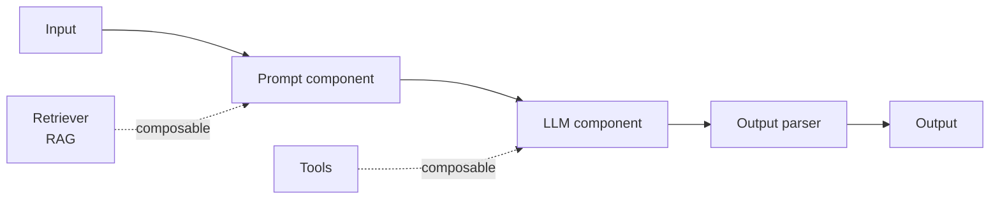

<KeyIdea>
**In one line**: LangChain is the most widely used **LLM application framework**. It abstracts the boilerplate of "calling models, calling tools, doing RAG, chaining steps, running agents" into uniform interfaces, so **you write less glue and more business logic**. Officially supported in Python and JS/TS.
</KeyIdea>

## What it is

Without a framework you write: HTTP to OpenAI, parse response, hit vector DB, build prompt, call OpenAI again, parse… and every project rewrites it.

LangChain wraps these into composable **components**:

```python
# Python LCEL syntax
from langchain_openai import ChatOpenAI
from langchain_core.prompts import ChatPromptTemplate

prompt = ChatPromptTemplate.from_template("Explain in one sentence: {topic}")
llm = ChatOpenAI(model="gpt-4o-mini")
chain = prompt | llm   # pipe-compose

chain.invoke({"topic": "RAG"})
```

The `prompt | llm` "**LCEL expression**" is the modern core abstraction — any component composes this way.

## Analogy

<Analogy>
LangChain is like **Express / FastAPI** for web apps:  
- Without a framework you can write HTTP, but every project re-implements routing / parsing / middleware.  
- The framework absorbs that, **so you focus on business logic**.
</Analogy>

## Key concepts

<Terms items={[
  { term: "LCEL", en: "LangChain Expression Language", def: "Pipe-compose components; auto streaming / batch / async / retry support." },
  { term: "Runnable", en: "Runnable", def: "Uniform interface across all LangChain components — any Runnable can invoke / stream." },
  { term: "Loaders / Splitters / Retrievers", en: "Data components", def: "The 'load file / chunk / retrieve' trio in any RAG pipeline." },
  { term: "Tools", en: "Tools", def: "Wrap Python functions / APIs as function-calling tools using a standard schema." },
  { term: "LangSmith", en: "Observability", def: "Official SaaS: trace, view per-step tokens / time / errors — the lifesaver for debugging LangChain." },
]} />

## How it works



Every component follows the same contract — **mix and match** to build RAG / agents / workflows.

## Practical notes

- **Start from LCEL; don't use old Chain classes.** Old `LLMChain` / `RetrievalQA` are deprecated; **new projects use LCEL only**.
- **Move complex agents to LangGraph.** LangChain suits **linear + simple branching**; multi-agent / long loops / state machines should use LangGraph directly.
- **Use LangSmith.** The free tier is enough for solo dev. **Tracing speeds up prompt-debugging 5×.**
- **Don't lock yourself in.** LangChain wraps things heavily — you can **always drop to the OpenAI SDK directly**. Mix tools as needed.
- **TS version is near-parity.** langchainjs works great for frontends / Next.js full-stack — **you don't have to use Python**.

## Easy confusions

<Compare
  leftTitle="LangChain"
  rightTitle="LlamaIndex"
  left={<>
    Full-stack framework — generic LLM-app orchestration.
  </>}
  right={<>
    Focused on **RAG / data ingest**.<br />
    Deeper at the data layer; lighter at the app layer.
  </>}
/>

<Compare
  leftTitle="LangChain"
  rightTitle="Native OpenAI SDK"
  left={<>
    High abstraction — swap model / vector DB **in one line**.<br />
    Learning curve + opacity.
  </>}
  right={<>
    Transparent, zero deps.<br />
    Each project writes more glue.
  </>}
/>

## Further reading

- [LlamaIndex](/ai/ecosystem/llamaindex) — RAG specialist in the same family
- [LangGraph](/ai/ecosystem/langgraph) — same company; fits agent state graphs
- Docs: [python.langchain.com](https://python.langchain.com) / [js.langchain.com](https://js.langchain.com)
