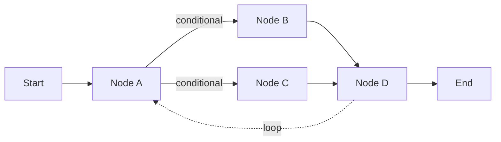

<KeyIdea>
**In one line**: LangGraph models agents and workflows as a directed graph of "**nodes + edges + shared state**". It solves what LangChain struggles to express — **loops, branching, human-in-the-loop, long-task resumption** — and is the most production-trusted agent orchestration framework today.
</KeyIdea>

## What it is

The minimal version:

```python
from langgraph.graph import StateGraph

def search_node(state):
    return {"docs": vector_db.search(state["query"])}

def answer_node(state):
    return {"answer": llm.invoke(state["query"], state["docs"])}

g = StateGraph(MyState)
g.add_node("search", search_node)
g.add_node("answer", answer_node)
g.add_edge("search", "answer")
g.set_entry_point("search")
app = g.compile()

app.invoke({"query": "Q3 refund policy"})
```

**Nodes are functions, edges are flow**, state passes between nodes. **Complex agents use conditional edges + loops**.

## Analogy

<Analogy>
- LangChain's `prompt | llm` = a **straight pipe**, water flows end to end.  
- LangGraph = a **circulating water/power diagram** — valves (conditional edges), pumps (loops), tanks (state), manual switches (interrupts).  
**Real businesses** almost always need this flexibility.
</Analogy>

## Key concepts

<Terms items={[
  { term: "Node", en: "Node", def: "Plain Python function: takes state, returns partial state." },
  { term: "Edge / Conditional Edge", en: "Edge / conditional edge", def: "Decides the next node. Conditional edges route based on state." },
  { term: "State", en: "State", def: "Dict passed between nodes; reducers define how fields merge." },
  { term: "Checkpointer", en: "Checkpointer", def: "Persist state to SQLite / Postgres / Redis — long tasks can be paused, resumed, replayed." },
  { term: "Interrupt", en: "Human-in-the-loop", def: "Pause at a node and wait for human approval — the canonical way to add HITL." },
]} />

## How it works



The whole graph is deterministic code — **diagrammable, debuggable, unit-testable**.

## Practical notes

- **Use LangGraph for non-trivial agents; stop using LangChain's `AgentExecutor`** — the old API is no longer recommended.
- **Checkpointer is the killer feature.** Long tasks (data migration, multi-agent coding) get **resumability + time-travel debugging** for free.
- **Interrupt replaces ad-hoc approvals.** For critical nodes (ordering, sending emails), use interrupt to wait for human sign-off — **the cleanest HITL pattern**.
- **Be precise about state.** Pick reducers carefully (appendable list / overwrite / merge) — **agent bugs usually trace back to state-merge issues**.
- **Pair with LangSmith.** Trace every edge and state — **debugging agents without it is unfeasible**.

## Easy confusions

<Compare
  leftTitle="LangGraph"
  rightTitle="LangChain"
  left={<>
    **Graph structure** — loops, branches, state, HITL natively expressed.<br />
    First choice for agents / long flows.
  </>}
  right={<>
    **Linear (LCEL)** — simplest in pure-linear cases.<br />
    Short-chain RAG / single-shot calls.
  </>}
/>

<Compare
  leftTitle="LangGraph"
  rightTitle="Workflow GUIs (Dify / Coze)"
  left={<>
    **Code-defined graph** — flexible, reviewable, diff-able.
  </>}
  right={<>
    **Drag-and-drop graph** — great for product/business users.<br />
    Engineering / complex logic is limited.
  </>}
/>

## Further reading

- [Agent](/ai/beginner/agent) / [Workflow](/ai/beginner/workflow) — LangGraph covers both
- [Multi-Agent](/ai/beginner/multi-agent) — LangGraph's strength
- [LangChain](/ai/ecosystem/langchain) — same team; complementary
- Docs: [langchain-ai.github.io/langgraph](https://langchain-ai.github.io/langgraph)
