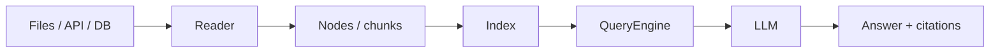

<KeyIdea>
**In one line**: LlamaIndex is the specialist for "**how to feed your company's data to an LLM**" — from reading files, chunking, indexing, retrieving, to feeding the retrieved snippets into the model. **The full RAG pipeline** is abstracted out. If your core need is "**make the AI understand my docs**", it's often faster than LangChain to start.
</KeyIdea>

## What it is

The classic three lines:

```python
from llama_index.core import VectorStoreIndex, SimpleDirectoryReader

# Read all files in a directory
docs = SimpleDirectoryReader("./my_docs").load_data()

# Build an index in one line (embedding + vector store)
index = VectorStoreIndex.from_documents(docs)

# Q&A in one line
query_engine = index.as_query_engine()
print(query_engine.query("What is our Q3 refund policy?"))
```

Its core abstractions are **Index** and **QueryEngine** — **less general than LangChain, but the RAG path is smoother**.

## Analogy

<Analogy>
- LangChain = **the Lego flagship store** — every brick imaginable; you can build anything.  
- LlamaIndex = **a "furniture kit"** — purpose-built for the RAG chair: **shorter manual, sturdier result**.
</Analogy>

## Key concepts

<Terms items={[
  { term: "Reader / Loader", en: "Data loader", def: "Hundreds of connectors: PDF / Notion / Slack / GitHub / SQL / web…" },
  { term: "Index", en: "Index", def: "Vector index / summary index / knowledge-graph index — not just vectors." },
  { term: "QueryEngine", en: "Query engine", def: "Encapsulates 'retrieve + rerank + generate' as one entrypoint." },
  { term: "Node", en: "Node (chunk)", def: "The smallest post-chunk unit, with metadata for filtering / citation." },
  { term: "Workflow", en: "Workflow", def: "Recent versions add LangGraph-style agent / state-machine capability." },
]} />

## How it works



It packages the full RAG flow as **plug-and-play takeover** — you pick a Reader / Index / Engine and **write less glue**.

## Practical notes

- **If your core is RAG, use this.** Customer-support KBs, private Q&A, doc QA — **a working demo in hours**.
- **Readers are a treasure trove.** Notion / Confluence / Jira / GitHub each have first-class loaders — **much faster than self-scraping**.
- **Beyond vectors.** Long docs → Summary Index first, drill down to nodes — **far more accurate than naive vector recall**.
- **In production use `IngestionPipeline`.** Turn "read → chunk → embed → store" into an incremental pipeline; **don't rebuild on each new doc**.
- **Complex agents still prefer LangGraph.** LlamaIndex's Workflow is catching up.

## Easy confusions

<Compare
  leftTitle="LlamaIndex"
  rightTitle="LangChain"
  left={<>
    Focused on **RAG / data**.<br />
    Faster to start; tighter constraints.
  </>}
  right={<>
    General orchestration — flows, agents, tools.
  </>}
/>

<Compare
  leftTitle="LlamaIndex"
  rightTitle="Roll your own RAG"
  left={<>
    A few lines and you have a demo.<br />
    Great for medium-scale KBs.
  </>}
  right={<>
    Full control; all the fancy optimisations.<br />
    Megascale deployments usually go this route.
  </>}
/>

## Further reading

- [RAG](/ai/beginner/rag) — its core mission
- [Embeddings](/ai/beginner/embeddings) / [Vector Database](/ai/beginner/vector-db) — internal dependencies
- [LangChain](/ai/ecosystem/langchain) — general-framework comparison
- Docs: [llamaindex.ai](https://www.llamaindex.ai)
