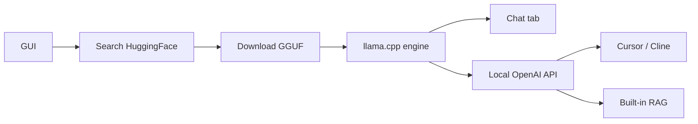

<KeyIdea>
**In one line**: LM Studio is a cross-platform desktop app that turns "**search model → download → tune GPU → chat / serve API**" into a graphical UI. llama.cpp under the hood — **the friendliest option for people who don't want to touch a terminal**.
</KeyIdea>

## Key features

<KV items={[
  { k: "Model library", v: "Built-in HuggingFace GGUF search; recommends what fits your VRAM / RAM." },
  { k: "Chat UI", v: "Multi-session, system prompt, parameter knobs, long context." },
  { k: "Local server", v: "One-click OpenAI-compatible API (http://localhost:1234)." },
  { k: "RAG", v: "Drop docs in → auto chunk + embed + retrieve." },
  { k: "Structured output", v: "Native JSON / GBNF grammar constraints; strong function calling." },
  { k: "Local SDK", v: "lmstudio-python / lmstudio-js wrappers." },
]} />

## Analogy

<Analogy>
Ollama is **the Linux geek's** style; LM Studio is **the macOS designer's** way to use LLMs. Capability is similar; **target audience differs**.
</Analogy>

## Key concepts

<Terms items={[
  { term: "GGUF quantization", en: "Q4_K_M / Q5_K / Q8_0", def: "Cards show a colour tag for 'will this run' based on your hardware." },
  { term: "Server", en: "Local API server", def: "One-click in the Developer tab; API key can be any string." },
  { term: "Hardware Detection", en: "Hardware detection", def: "Auto-uses Metal (mac) / CUDA / Vulkan / ROCm." },
  { term: "Multi-model", en: "Multi-model", def: "Multiple models loaded at once; routed per request." },
  { term: "Prompt Templates", en: "Chat templates", def: "ChatML / Llama / Qwen built-in; auto-picked on import." },
]} />

## How it works

## Practical notes

- **Don't fiddle with knobs needlessly.** Defaults are fine for chat; sliders for temperature / Top-P.
- **Use the API as OpenAI's**: `OPENAI_API_BASE=http://localhost:1234/v1 OPENAI_API_KEY=lm-studio`.
- **macOS Metal performs great.** M3 Max runs 70B Q4 reasonably.
- **Headless background**: enable `Headless` mode / use `lms server start` CLI; close GUI, API stays.
- **RAG is light.** Built-in is good for personal use; enterprises should still wire a real vector DB + LangChain / LlamaIndex.
- **Offline-friendly.** Once downloaded, models work fully offline — perfect for privacy / classified scenarios.

## Easy confusions

<Compare
  leftTitle="LM Studio"
  rightTitle="Ollama"
  left={<>
    GUI + one-click API. 
    Desktop user friendly.
  </>}
  right={<>
    CLI + daemon. 
    Scripts / tool integration smooth.
  </>}
/>

## Further reading

- [Ollama](/ai/ecosystem/ollama)
- [Local Inference](/ai/advanced/local-inference)
- [Quantization](/ai/advanced/quantization)
