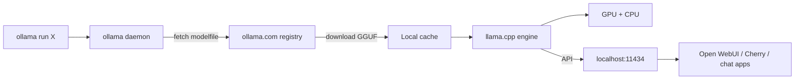

<KeyIdea>
**In one line**: Ollama wraps llama.cpp into **a Docker-style CLI** — **`ollama run llama3.2`** and you're up. Auto-quant downloads, API server, model registry — personal / local dev without GPU configuration headaches.
</KeyIdea>

## Cheatsheet

```bash
# Install: one liner on mac/linux; installer on Windows
curl -fsSL https://ollama.com/install.sh | sh

# Run
ollama run qwen2.5:7b
ollama run llama3.2
ollama run deepseek-r1:8b

# List / remove
ollama list
ollama rm qwen2.5:7b

# Expose API (default http://localhost:11434)
ollama serve
```

API is OpenAI v1 compatible (`OLLAMA_HOST=0.0.0.0:11434` + `/v1/chat/completions`); mainstream frontends/tools connect directly.

## Analogy

<Analogy>
Running LLMs locally used to mean **installing a GPU + compiling CUDA + finding GGUF quants**: doable, high friction.  
Ollama is the **App Store**: search the model → click install → use instantly.
</Analogy>

## Key concepts

<Terms items={[
  { term: "Modelfile", en: "Modelfile", def: "Dockerfile-style: FROM <base> + SYSTEM <prompt> + PARAMETER <temperature>..." },
  { term: "Tag", en: "Tag", def: "qwen2.5:7b, qwen2.5:14b-instruct-q4_0; after the colon: size / quantisation / variant." },
  { term: "GGUF", en: "Quant format", def: "llama.cpp's efficient inference format — supports q4 / q5 / q8 / fp16." },
  { term: "GPU offload", en: "GPU offload", def: "OLLAMA_NUM_GPU sets how many layers go on GPU; rest in RAM." },
  { term: "Context Length", en: "Context length", def: "`PARAMETER num_ctx 32768`; beyond the model's native context, RoPE extrapolation is needed." },
  { term: "Embeddings", en: "Embeddings", def: "`ollama embed` for local embedding generation." },
]} />

## How it works



## Practical notes

- **Pick a model.** Mac M-series 16 GB runs 7–8B Q4 smoothly; 32 GB handles 14B; 70B needs 64 GB+ or aggressive quantisation.
- **Custom system prompt.** Inside a `Modelfile`: `SYSTEM "..."` + `PARAMETER temperature 0.4`, then `ollama create my-llama -f Modelfile`.
- **API is localhost-only by default.** For LAN access: `OLLAMA_HOST=0.0.0.0:11434 ollama serve` + firewall rules.
- **GPU not engaged?** `ollama ps` shows the GPU-offload line; check with nvidia-smi / Activity Monitor.
- **Hooking up Cherry Studio / LobeChat / Open WebUI**: just point at the OpenAI-compatible endpoint.
- **Embeddings.** `ollama embed -m nomic-embed-text "sentence"` — local RAG without an embedding API.
- **Production alternative.** High concurrency → vLLM / TGI; Ollama is best for single-user / personal / edge.

## Easy confusions

<Compare
  leftTitle="Ollama"
  rightTitle="LM Studio"
  left={<>
    CLI + background service.<br />
    Frontends / tools can hit it directly.
  </>}
  right={<>
    Desktop GUI.<br />
    Best for purely interactive use.
  </>}
/>

## Further reading

- [LM Studio](/ai/ecosystem/lm-studio)
- [Local Inference](/ai/advanced/local-inference)
- [Quantization](/ai/advanced/quantization)
