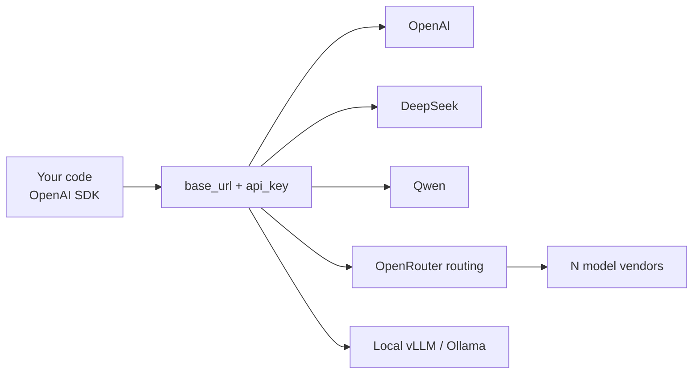

<KeyIdea>
**In one line**: OpenAI's `/v1/chat/completions` has become **the de-facto LLM API standard**. DeepSeek / Qwen / GLM / Moonshot / SiliconFlow / Together / OpenRouter / vLLM / Ollama / LM Studio — **almost everyone is compatible**. One codebase swaps providers by changing `base_url` and `api_key`.
</KeyIdea>

## What it is

```python
from openai import OpenAI

# Any vendor
client = OpenAI(
    base_url="https://api.deepseek.com/v1",   # change URL = change vendor
    api_key="sk-xxx",
)

resp = client.chat.completions.create(
    model="deepseek-chat",
    messages=[{"role": "user", "content": "hello"}],
    stream=True,
)
for chunk in resp:
    print(chunk.choices[0].delta.content or "", end="")
```

## Analogy

<Analogy>
Like the USB port: phones, mice, and cameras have **different shapes inside**, but all expose USB — swapping devices just means plugging in a cable. OpenAI's API is the **USB of the LLM industry**.
</Analogy>

## Major compatible providers

<KV items={[
  { k: "OpenAI itself", v: "https://api.openai.com/v1 — gpt-4o, o-series, gpt-5." },
  { k: "Anthropic", v: "https://api.anthropic.com — not byte-identical (its own protocol), but the official SDK feels similar." },
  { k: "DeepSeek", v: "https://api.deepseek.com — deepseek-chat / deepseek-reasoner. Cheap and strong." },
  { k: "Qwen / Alibaba", v: "https://dashscope.aliyuncs.com/compatible-mode/v1 — qwen-max / qwen-plus / qwen3." },
  { k: "Zhipu GLM", v: "https://open.bigmodel.cn/api/paas/v4 — glm-4.6, glm-4.5-air." },
  { k: "Moonshot Kimi", v: "https://api.moonshot.cn/v1 — moonshot-v1-32k etc." },
  { k: "OpenRouter", v: "https://openrouter.ai/api/v1 — single endpoint to dozens of vendors' models." },
  { k: "SiliconFlow / Together / Fireworks / Groq", v: "Aggregate open-source models, billed per token." },
  { k: "Local", v: "vLLM / Ollama / LM Studio / Llama.cpp server / Mistral.rs — all OpenAI-compatible." },
]} />

## How it works



## Subtle differences

Although compatible, each vendor has subtle quirks:

- **`tools` (function calling)**: OpenAI standard / Anthropic differ in schema; DeepSeek and Qwen are largely OpenAI-compatible.
- **Structured output**: `response_format: { type: "json_schema" }` support varies.
- **Streaming chunks**: reasoning models like DeepSeek-R1 emit thoughts in `delta.reasoning_content`.
- **Multimodal**: OpenAI uses `image_url`; Qwen also accepts `image_url`; some vendors use proprietary schemas.
- **Token / context limits**: max input/output lengths vary per vendor.

## Practical notes

- **Externalise `LLM_PROVIDER` + `BASE_URL`** in config — swapping vendors = env change only.
- **Don't hard-code model names.** In production use aliases (your layer calls it `chat-fast`, mapping to the actual model).
- **Rate limits / retries / backoff**: vary per vendor; centralise in your client. OpenRouter offers fallback routing.
- **Cost compare**: DeepSeek-V3 / GLM / Qwen mainstream models are **5–20× cheaper** than OpenAI at the same tier. Develop on OpenAI, ship on cheaper / open-source.
- **Compliance**: data residency, training-data inclusion — read the terms.
- **Streaming disconnect**: SSE breaks on flaky networks; client must retry + handle idempotency.

## Easy confusions

<Compare
  leftTitle="OpenAI-compatible API"
  rightTitle="OpenAI-only features"
  left={<>
    `chat.completions` and basic endpoints.<br />
    All vendors target this surface.
  </>}
  right={<>
    Realtime API, Assistants, Files, Fine-tune, batch.<br />
    Most third parties don't implement / partially implement these.
  </>}
/>

## Further reading

- [Chinese API Providers (DeepSeek / Qwen / GLM)](/ai/ecosystem/cn-api-providers)
- [OpenRouter / Model aggregation](/ai/ecosystem/openrouter)
- [Function Calling](/ai/beginner/function-calling)
