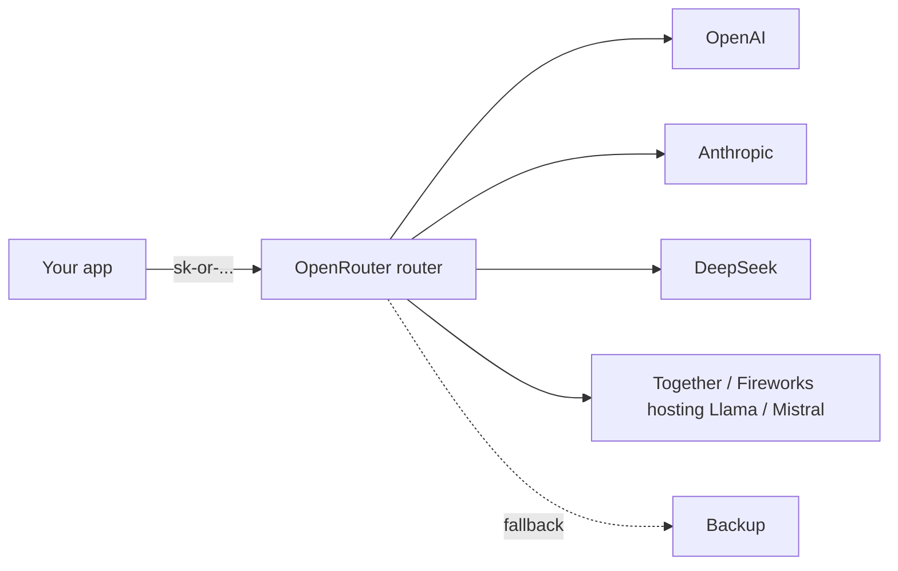

<KeyIdea>
**In one line**: OpenRouter is the **wholesale market for LLMs** — wires up OpenAI / Anthropic / Google / Meta / DeepSeek / Mistral / many open-weights hosts behind one OpenAI-compatible endpoint. **Cost savings + redundancy + price comparison** in one stop.
</KeyIdea>

## What it is

```python
from openai import OpenAI

c = OpenAI(
    base_url="https://openrouter.ai/api/v1",
    api_key="sk-or-...",
)

# Specify any model
c.chat.completions.create(model="anthropic/claude-3.5-sonnet", messages=[...])
c.chat.completions.create(model="deepseek/deepseek-chat",     messages=[...])
c.chat.completions.create(model="meta-llama/llama-3.1-70b-instruct", messages=[...])
```

Model name format: `vendor/model-id`.

## Analogy

<Analogy>
Going direct to each vendor = **opening a membership card per shop** — N stores, N cards, N quotas.  
OpenRouter = **a single all-shops card** — one card swipes everywhere, one bill.
</Analogy>

## Key capabilities

<Terms items={[
  { term: "Unified billing", en: "Unified billing", def: "All models drawn from one OpenRouter balance. **One invoice.**" },
  { term: "Routing / Fallback", en: "Routing / fallback", def: "Pass a `models` array; if the primary fails OpenRouter falls back automatically." },
  { term: "Pricing transparency", en: "Per-model pricing", def: "/models endpoint returns live input/output prices per model." },
  { term: "Provider preference", en: "Provider preference", def: "Same open-weights model is often hosted by Together / Fireworks / Lepton — you can specify preferences." },
  { term: "Stream / Tools / Vision", en: "Feature passthrough", def: "Most upstream features pass through unchanged." },
  { term: "App identification", en: "HTTP-Referer / X-Title", def: "OpenRouter uses these headers to identify the calling application." },
]} />

## How it works



OpenRouter handles **auth / billing / routing / quota** in the middle.

## Practical notes

- **Multi-model fallback**:

  ```json
  {
    "models": [
      "anthropic/claude-3.5-sonnet",
      "openai/gpt-4o",
      "deepseek/deepseek-chat"
    ]
  }
  ```

  Listed in fallback order. 5xx / rate-limit on the first auto-switches to the next.

- **Tracking metrics**: OpenRouter dashboard shows success rate / latency / cost per model.
- **Data policy**: each provider's "trains on requests?" status is on the model card — for sensitive data, set `--data-policy strict`.
- **Streaming behaviour**: vendor differences (reasoning content / tool deltas) are normalised but not 100% — read `metadata` to see the actual backend.
- **Rate limits**: OpenRouter has its own caps + provider caps. **Spread bursts in time.**
- **From China**: direct connection can be slow; a self-hosted proxy + Cloudflare Tunnel is a common workaround.

## Easy confusions

<Compare
  leftTitle="OpenRouter (aggregator)"
  rightTitle="LiteLLM (local proxy)"
  left={<>
    SaaS with unified billing.<br />
    Convenient, but every call traverses them.
  </>}
  right={<>
    OpenAI-compatible proxy you run yourself.<br />
    Data avoids a third party; you provide each vendor's key.
  </>}
/>

## Further reading

- [OpenAI-Compatible API](/ai/ecosystem/openai-compatible)
- [Chinese API Providers](/ai/ecosystem/cn-api-providers)
- [vLLM](/ai/ecosystem/vllm)
