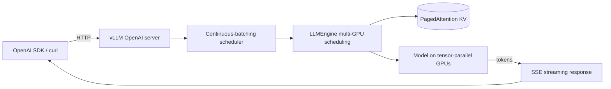

<KeyIdea>
**In one line**: vLLM is a GPU-targeted high-throughput LLM inference engine. **PagedAttention** makes the KV cache as memory-efficient as paged virtual memory; **Continuous Batching** keeps throughput maxed. The default for production OpenAI-compatible APIs.
</KeyIdea>

## Start serving in one line

```bash
pip install vllm

# Single-GPU 7B
python -m vllm.entrypoints.openai.api_server \
  --model Qwen/Qwen2.5-7B-Instruct \
  --port 8000

# Multi-GPU tensor parallel
... --tensor-parallel-size 2

# Quantised
... --quantization awq
```

API is fully OpenAI-compatible (`/v1/chat/completions` / `/v1/completions` / `/v1/models`); change `base_url` in the `openai` SDK and you're good.

## Analogy

<Analogy>
HuggingFace `transformers`' built-in `generate()` is the **home printer**: it works, but queues up at scale.  
vLLM is the **commercial press**: imposition, batching, pipelined — ten thousand pages an hour without breaking a sweat.
</Analogy>

## Key concepts

<Terms items={[
  { term: "PagedAttention", en: "Paged KV", def: "KV cache split into 16-token uniform blocks, allocated on demand → near-zero fragmentation." },
  { term: "Continuous Batching", en: "Continuous batching", def: "New requests can join an in-flight batch — 5–20× throughput vs vanilla." },
  { term: "Tensor Parallel", en: "Tensor parallel", def: "Slice each layer across GPUs. --tp 2/4/8. Best on same NUMA / NVLink." },
  { term: "Pipeline Parallel", en: "Pipeline parallel", def: "Different layers on different GPUs; for very large models or multi-node." },
  { term: "AWQ / GPTQ / FP8", en: "Quantisation", def: "vLLM loads several quant formats directly." },
  { term: "Prefix Cache", en: "Prefix cache", def: "Shared prefixes (system prompts) computed once. --enable-prefix-caching." },
  { term: "Speculative Decoding", en: "Speculative decoding", def: "Built-in draft-model / Medusa support." },
  { term: "LoRA Adapter", en: "LoRA hot-swap", def: "Load multiple LoRAs at runtime; route per request." },
]} />

## How it works



## Practical notes

- **`--max-model-len`**: tune for VRAM; defaults to the model's full context and may OOM.
- **`--gpu-memory-utilization`**: default 0.9; lower to 0.45 if sharing a GPU between models.
- **Quant choice**: AWQ usually best quality; GPTQ broadest compatibility; FP8 only on H100/H200-class.
- **Multi-LoRA**: `--enable-lora --lora-modules name1=path1 name2=path2`; per-request `model: name1` selects an adapter.
- **Speculative decoding**: pair with `--speculative-model`; typical speedup 1.5–2×.
- **K8s deployment**: KubeRay or LWS (LeaderWorkerSet) for multi-node tensor parallel.
- **Alternatives**: TensorRT-LLM (NVIDIA), SGLang (richer routing), TGI (HuggingFace), llama.cpp (CPU).

## Easy confusions

<Compare
  leftTitle="vLLM"
  rightTitle="Ollama / llama.cpp"
  left={<>
    GPU serving, **high-concurrency production**.<br />
    OpenAI-compatible API.
  </>}
  right={<>
    CPU + GPU general purpose, **single-machine convenience**.<br />
    Can run 70B but throughput is lower.
  </>}
/>

## Further reading

- [Ollama](/ai/ecosystem/ollama)
- [KV Cache](/ai/advanced/kv-cache)
- [Speculative Decoding](/ai/advanced/speculative-decoding)
